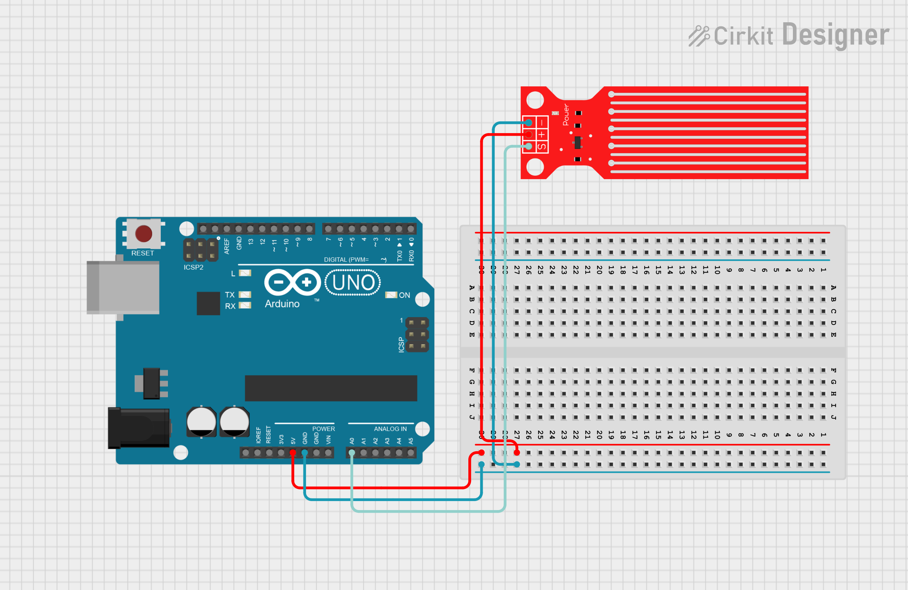
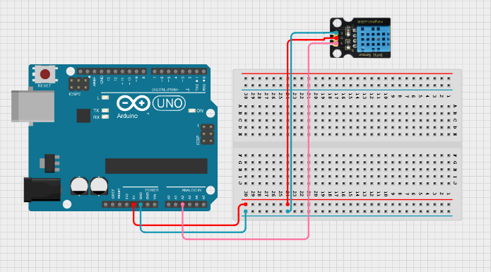
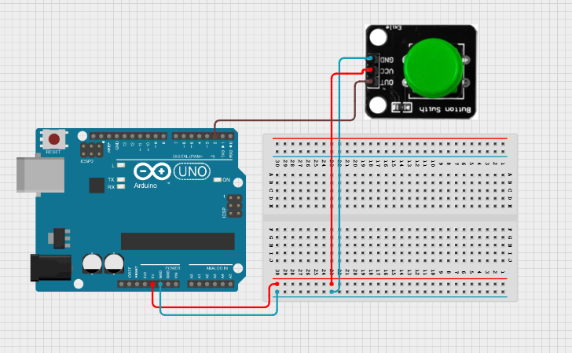

# Időjárás állomás


---
## Vízszint érzékelő

📄 Leírás

A Keyestudio vízérzékelő egy könnyen használható, hordozható és költséghatékony eszköz 💧, amelyet vízszint és vízcsepp felismerésére terveztek.

Ez a kis érzékelő képes a vízcseppek mennyiségét vagy a víz mennyiségét mérni egy sor, párhuzamosan elhelyezett, csupasz vezeték nyomon keresztül 🧪.

⭐ Jellemzők
- Zökkenőmentes átváltás a vízmennyiség és az analóg érték között 🔁
- Nagyfokú rugalmasság, egyszerű analóg érték kimenet 🔧
- Alacsony energiafogyasztás és nagy érzékenység ⚡👃
- Közvetlenül csatlakoztatható mikrokontrollerhez vagy más logikai áramkörökhöz 🤖

Támogatja többek között az Arduino-t, STC mikrovezérlőt, AVR mikrovezérlőt és egyéb fejlesztői platformokat 🧠🔌

📐 Műszaki adatok
- ⚡ Működési feszültség: DC 5V
- 🔌 Működési áram: < 20mA
- 🎛️ Érzékelő típusa: Analóg
- 📏 Érzékelési terület: 40mm × 16mm
- 🛠️ Gyártási technológia: FR4, kétoldalas ónbevonat
- 🌀 Forma kialakítása: Csúszásgátló, félhold alakú mélyedés
- 🌡️ Üzemi hőmérséklet: 10℃ – 30℃
- 💧 Üzemi páratartalom: 10% – 90% (kondenzáció nélkül)
- ⚖️ Tömeg: 3g
- 📦 Méret: 65mm × 20mm × 8mm

Kapcsolási rajz:



Példakód:
``` cpp
int led = 13; 
int val = 1; 
int data = 0; 

void setup()
{
  pinMode(led, OUTPUT); 
  Serial.begin(9600); 
}
void loop()
{
  val = analogRead(1); 

  if(val>700)
  {  
    digitalWrite(led,HIGH);
  }  
  else {
    digitalWrite(led,LOW); 
  }
  data = val; 

  if (data > 0) {
    Serial.println("Eső van! ");
    Serial.println(data); 
  }
  else {
    Serial.println("Száraz az idő! ");
    Serial.println(data);
  }

  delay(1000);
}
```

## DHT11 - Hőmérséklet és páratartalom érzékelő

🌡️💧 Bevezetés

A DHT11 szenzor kalibrált digitális jelkimenettel rendelkezik, és egyben hőmérséklet- és páratartalom-érzékelő egység is.
A beépített technológia magas megbízhatóságot és kiváló hosszú távú stabilitást biztosít 🛡️📈.

Egy nagy teljesítményű, 8 bites mikrokontroller van az érzékelőhöz csatlakoztatva 🤖.
A szenzor tartalmaz egy ellenállásos elemet és egy nedvességérzékelő NTC hőmérsékletmérő eszközt 🌬️🌡️.

⭐ Előnyök
- Kiváló minőség ✅
- Gyors válaszidő ⚡
- Jó zavarvédelem 🔇
- Költséghatékony megoldás 💰

Minden DHT11 érzékelő rendkívül pontos kalibrációs adatokat tartalmaz, melyeket egy páratartalom-kalibráló kamrában rögzítenek 🎯.  
A kalibrációs együtthatók az OTP programmemóriában vannak tárolva 💾.  
A belső szenzorok a jelek feldolgozása során ezeket az együtthatókat használják.  

Az egyszálas soros interfész lehetővé teszi az egyszerű és gyors kommunikációt 🔗.  
Kis méret, alacsony fogyasztás és akár 20 méteres jeltovábbítási távolság miatt széles körben használható, akár a legnagyobb igénybevétel esetén is 📡📦.

📐 Műszaki adatok
- ⚡ Tápfeszültség: +5V
- 🌡️ Hőmérséklet-tartomány: 0–50°C (±2°C hibahatárral)
- 💧 Páratartalom: 20–90% RH (±5% RH hibahatárral)
- 🔌 Interfész: Digitális

Kapcsolási rajz:



Példakód:
``` cpp
#include <dht.h>

dht DHT;
#define DHT11_PIN 2  // A szenzor adatlábja a D2-re van kötve (Arduino-n)

void setup() {
  Serial.begin(9600);
  Serial.println("DHT11 TESZT PROGRAM");
  Serial.println("Típus\tÁllapot\tPáratartalom (%)\tHőmérséklet (C)");
}

void loop() {
  int chk = DHT.read11(DHT11_PIN);  // DHT11 típushoz read11() kell

  Serial.print("DHT11\t");

  switch (chk) {
    case DHTLIB_OK:
      Serial.print("OK\t");
      break;
    case DHTLIB_ERROR_CHECKSUM:
      Serial.print("Checksum hiba\t");
      break;
    case DHTLIB_ERROR_TIMEOUT:
      Serial.print("Időtúllépés\t");
      break;
    default:
      Serial.print("Ismeretlen hiba\t");
      break;
  }

  Serial.print(DHT.humidity, 1);
  Serial.print("\t\t");
  Serial.println(DHT.temperature, 1);

  delay(2000);  // 2 másodperc várakozás
}

```
> Könyvtárat itt is kell letölteni!
> A bal oldalon a 3. ikonra rákattintva a könyvtárak között lehet böngészni.
> A letöltendő könyvtárakat a DHTlib néven találod és azt le kell tölteni!

## Környezeti fényérzékelő

💡 Leírás

Előbb-utóbb szükséged lesz arra, hogy a környezeti fényerőt nagyobb pontossággal érzékeld, mint amit egy hagyományos fényellenállás (LDR) nyújt – anélkül, hogy bonyolultabbá tennéd a projektedet ⚙️🌞.  
Amikor ez elérkezik, érdemes beszerezned egy TEMT6000 környezeti fényérzékelőt 📦🔦.

A TEMT6000 érzékenysége az emberi szem működéséhez van hangolva 👁️✨, de gyenge fényviszonyok között kevésbé teljesít jól 🌑.  
Ugyanakkor kiválóan érzékeli az apró fényváltozásokat egy széles fényerőtartományon belül 🌗➡️🌕.

Mivel az emberi szemhez hasonlóan működik, nem reagál jól az infravörös (IR) vagy UV fényre 🔴❌🟣 – ezt tartsd szem előtt a projekted tervezésénél.

📐 Műszaki adatok
- ⚡ Tápfeszültség: +5V DC, 50mA
- 📏 Méret: 36.5 × 16 mm
- ⚖️ Tömeg: 4g

Kapcsolási rajz:


Példakód:
``` cpp
int temt6000Pin = 1;

void setup() {
  Serial.begin(9600);
}
void loop() {

 int value = analogRead(temt6000Pin);

 if (value < 2)
 {
    Serial.print("Sötét van! - ");
    Serial.println(value);
 }
 else if (value > 2 && value < 50)
 {
    Serial.print("Normál fényerősség! - ");
    Serial.println(value);
 }
 else
 {
    Serial.print("Túl világos van! - ");
    Serial.println(value);
 }

 delay(1000); 
}
```

## LCD kijelző potméterrel

📄 Leírás
Ebben a projektben egy 0802-es LCD kijelzőt fogunk vezérelni, amelyhez a V4.0 fejlesztőpanelt használjuk. ⚙️📟

Az LCD kijelző 8 oszlop és 2 sor megjelenítésére képes (8x2 karakter), és a chip működési feszültsége 4,5–5,5V között van. ⚡🔋

Az 0802-es LCD kétféleképpen köthető be a szövegmegjelenítéshez:
- 4-bites módban 🧩
- 8-bites módban 🔗
(attól függően, hány adatvezetéket használsz)
> Mi a 4-bites módot fogjuk használni a feladat során!

🧰 Szükséges hardverelemek
A következő alkatrészeket kell előkészítened a projekthez: 🔧🧪
- ✅ V4.0 Fejlesztőpanel × 1
- 📟 0802 LCD kijelző × 1
- 🎚️ Forgatható potméter × 1 (a kontraszt beállításához)
- 🧱 Breadboard (próbatábla) × 1
- 🔌 USB kábel × 1 (az áramellátáshoz és programozáshoz)
- 🔗 Ugróvezetékek (jumper wire) – néhány darab
- 🔌 Dupont kábelek – néhány darab (a bekötésekhez)

Kapcsolási rajz:


Példakód:
``` cpp
//////////////////////////////////////////////////////////
#include <LiquidCrystal.h>
// initialize the library with the numbers of the interface pins
LiquidCrystal lcd(11, 12, 6, 7, 4, 5);

void setup() {
  // set up the LCD's number of columns and rows:
  lcd.begin(8, 2);
  // Print a message to the LCD.
  lcd.setCursor(0, 0);
  lcd.print(" Hello");
  lcd.setCursor(0, 1);
  lcd.print(" world!");
}

void loop() {
}
//////////////////////////////////////////////////////////
```
> Fontos: A LiquidCrystal teljes és jól működése érdekében fontos letölteni a hozzá tartozó könyvtárakat is!
> Ezt a bal oldalon a 3. ikonra rákattintva tudod megtenni. Itt a keresőbe beírva 2 könyvtárat is kihoz LiquidCrystal és Adafruit LiquidCrystal néven. Érdemes mindettőt letölteni, ha esetleg nem lenne rajta a gépen!

### Egy kis segítség a gomb bekötése

Gomb kapcsolási rajza:



Példakód
``` cpp

```


---
# Teljes rendszer


# Extra feladat
