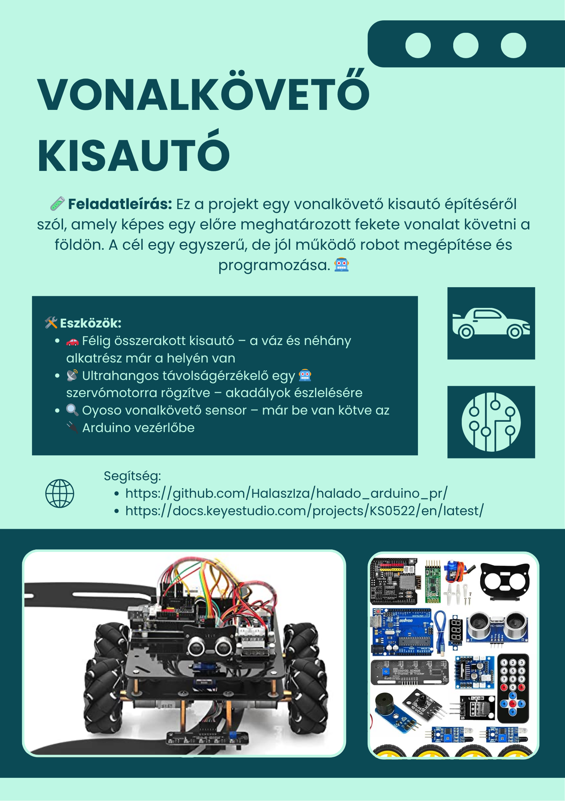
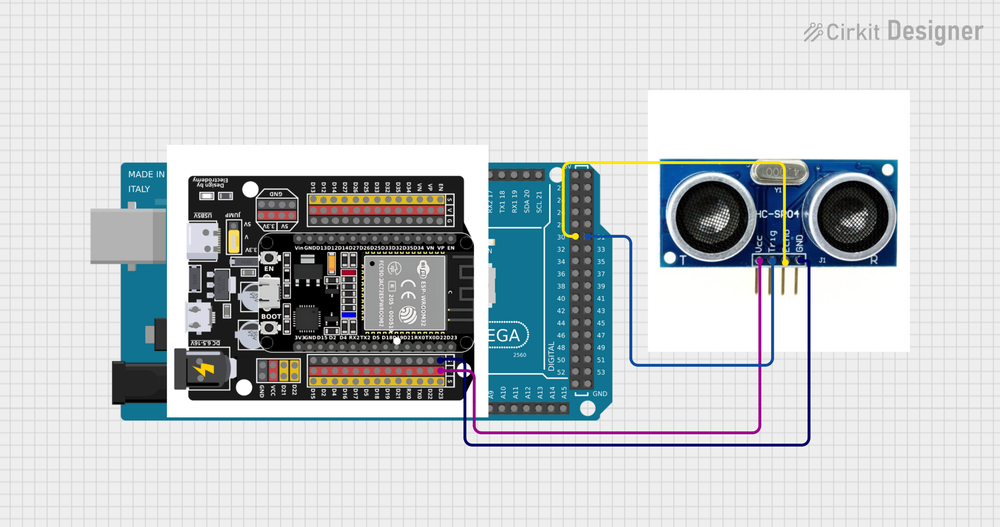

# Vonalkövető kisautó


> Linkek:    
> https://docs.keyestudio.com/projects/KS0522/en/latest/

## Feladat leírása:
🛠️ Fő funkciók:
- ⚙️ A szenzorok (pl. infravörös érzékelők) segítségével a vonal érzékelése
- 🔄 A motorok vezérlése a vonal követéséhez
- 🧠 Az irányító logika (pl. Arduino kód) megírása
- 🔋 Energiaellátás biztosítása
- 🧪 Tesztelés különböző pályákon

🎯 Cél:
- Megbízható, folyamatos vonalkövetés
- Gyors reagálás kanyarokra és elágazásokra
- Egyszerű, áttekinthető programkód

### Ultrahangos érzékelő működése:



``` cpp
//**********************************************************************************

const int TrigPin = 31; // Trig megadása, melyik lábra van kötve
const int EchoPin = 30; // Echo megadása, melyik lábra van kötve

int duration = 0; // Állítsd be a 'duration' (időtartam) kezdeti értékét 0-ra
int distance = 0;// Állítsd be a 'distance' (távolság) kezdeti értékét 0-ra

void setup() 
{
  pinMode(TrigPin , OUTPUT); // kimeneti módba áll a TrigPin
  pinMode(EchoPin , INPUT); // bemeneti módba áll az EchoPin
  Serial.begin(9600);  // A soros monitort 9600 baud sebessége, hogy lásd a pingelés eredményét
}
void loop()
{
 // Állítsd a trigPin-t magas szintre 10 mikrosecundum (10 μs) ideig, hogy aktiváld a HC-SR04 szenzort.
  digitalWrite(TrigPin , HIGH);
  delayMicroseconds(10);
  digitalWrite(TrigPin , LOW);

  // Várd meg, amíg a HC-SR04 visszatér magas szintre, és mérd meg ezt a várakozási időt.
  duration = pulseIn(EchoPin , HIGH);

  // Számítsd ki a távolságot az idő alapján
  distance = (duration/2) / 28.5 ;
  Serial.print("Distance: ");
  Serial.print(distance); // Írasd ki a távolság értékét a soros portra.
  Serial.println("cm");
  delay(300); // Várj 100ms két pingelés között (kb 20 pings/sec).
}
//**********************************************************************************
```

### OSOYOO szenzor működése
