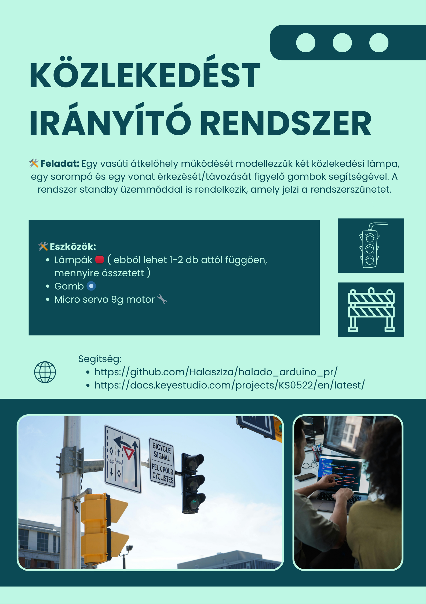
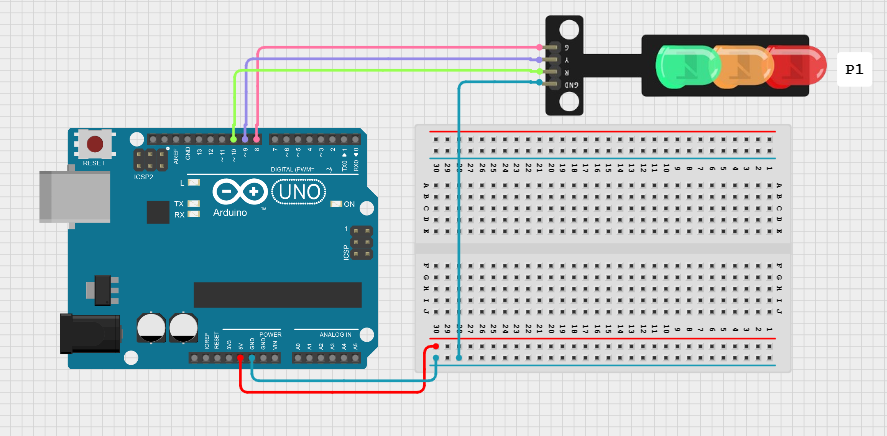
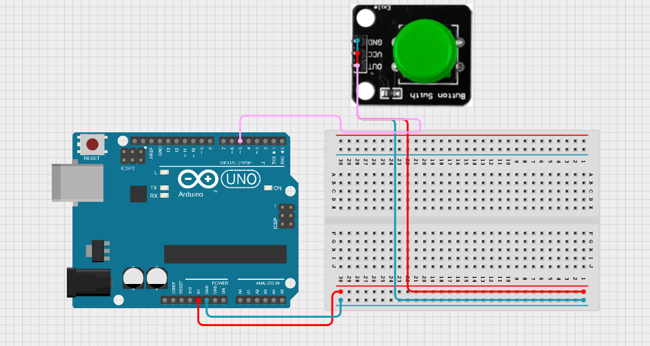
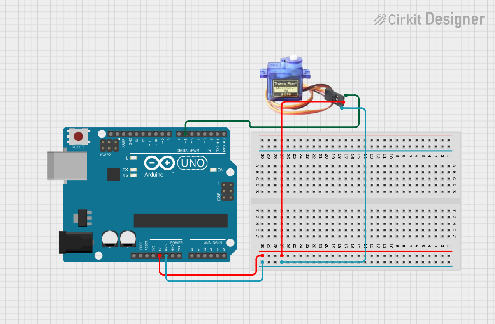
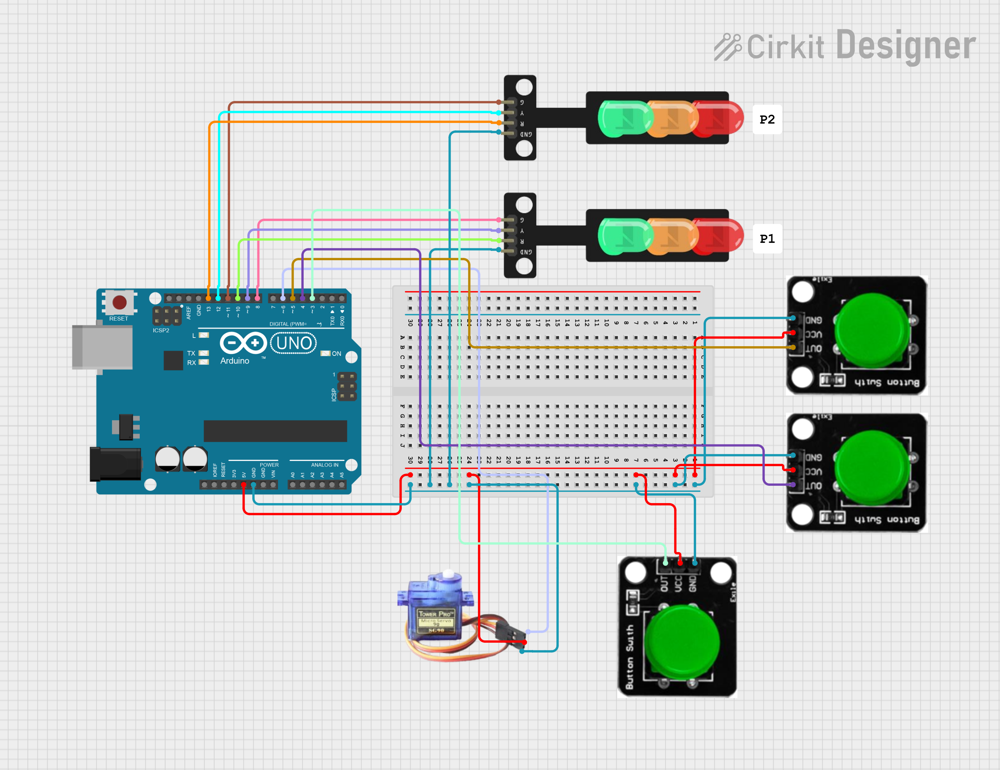

# Közlekedést irányító rendszer



🎯Feladat: Hozz létre egy rendszert, ami képes irányítani lámpát 🏮, lámpa párokat 🔴🟢 és egy klassz sorompót 🚧

🛠️ Eszközök, amikre szükséged lesz:
- Lámpák 🏮 ( ebből lehet 1-2 db attól függően, mennyire összetett )
- Gomb 🔘
- Micro servo 9g motor 🔧

## Közlekedési lámpa 🚥🚦

**📘 Leírás:**  
A mikrokontroller tanulása során gyakran használnak három LED-et – piros 🔴, zöld 🟢 és sárga 🟡 fényeket – a közlekedési lámpa villogásának szimulálására külső kapcsolatokkal.  

Ezúttal egy különleges modult terveztünk, amely nagyon kényelmes a bekötés szempontjából, és a modulon megtalálható a piros 🔴, sárga 🟡 és zöld 🟢 LED is.  

Ez a modul teljes mértékben kompatibilis az Arduino mikrokontrollerrel 🤖 és a Raspberry Pi rendszerrel 🍓.  

**⚙️ Specifikáció:**
- Működési feszültség: 3.3–5V 🔋
- Interfész típusa: digitális 📟
- Csatlakozó: PH2.54 🔌

**Kapcsolási rajz:**



**Példakód:**
``` cpp
////////////////////////////////////////////////////////////////////
int redled =5; // initialize digital pin 5.
int yellowled =4; // initialize digital pin 4.
int greenled =3; // initialize digital pin 3.
void setup()
{
pinMode(redled, OUTPUT);// set the pin with red LED as “output”
pinMode(yellowled, OUTPUT); // set the pin with yellow LED as “output”
pinMode(greenled, OUTPUT); // set the pin with green LED as “output”
}
void loop()
{
digitalWrite(greenled, HIGH);//// turn on green LED
delay(5000);// wait 5 seconds
digitalWrite(greenled, LOW); // turn off green LED
for(int i=0;i<3;i++)// blinks for 3 times
{
delay(500);// wait 0.5 seconds
digitalWrite(yellowled, HIGH);// turn on yellow LED
delay(500);// wait 0.5 seconds
digitalWrite(yellowled, LOW);// turn off yellow LED
} 
delay(500);// wait 0.5 seconds
digitalWrite(redled, HIGH);// turn on red LED
delay(5000);// wait 5 seconds
digitalWrite(redled, LOW);// turn off red LED
}
////////////////////////////////////////////////////////////////////
```

## Gomb 🔘

**📘 Leírás:**
Ez egy alap nyomógomb modul 🟠. Egyszerűen bedugható egy IO shield-be, így ideális az első Arduino próbálkozásokhoz 🤖.

**✨ Jellemzők:**
- Széles feszültségtartomány: 3.3V – 5V 🔋
- Könnyen felismerhető érzékelő interfészek – „A” az analóg, „D” a digitális jelekhez 📟
- Szabványos rögzítő furat 🔩
- Áttekinthető ikonokkal jelölve 👀
- Magas minőségű csatlakozó 🔌
- Egyszerűen csatlakoztatható és használható 🧩
- Nagyméretű gomb és strapabíró gombfedél 🔘
- Kiváló interaktív és kreatív projektekhez 🎮🎨

**⚙️ Specifikáció:**
- Tápfeszültség: 3.3V – 5V 🔋
- Interfész: Digitális 📟
- Méretek: 30 × 20 mm 📏
- Tömeg: 4 g ⚖️

**Kapcsolási rajz:**



**Példakód:**
``` cpp
////////////////////////////////////////////////////////////////////
/* # When you push the digital button, the Led 13 on the board will be turned on. Otherwise,the led is turned off.
*/
int ledPin = 13;                // choose the pin for the LED
int inputPin = 3;               // Connect sensor to input pin 3 
void setup() {
  pinMode(ledPin, OUTPUT);      // set LED as output
  pinMode(inputPin, INPUT);     // set pushbutton as input
}
void loop(){
  int val = digitalRead(inputPin);  // read input value
  if (val == HIGH) {            // check if the input is HIGH
    digitalWrite(ledPin, LOW);  // turn LED OFF
  } else {
    digitalWrite(ledPin, HIGH); // turn LED ON
  }
}
////////////////////////////////////////////////////////////////////
```

## Servo motor

**Leírás:**

**Kapcsolási rajz:**



**Példakód:**
``` cpp

```

# A végleges rendszer

**Leírás:**

**Kapcsolási rajz:**




# Extra feladat:
