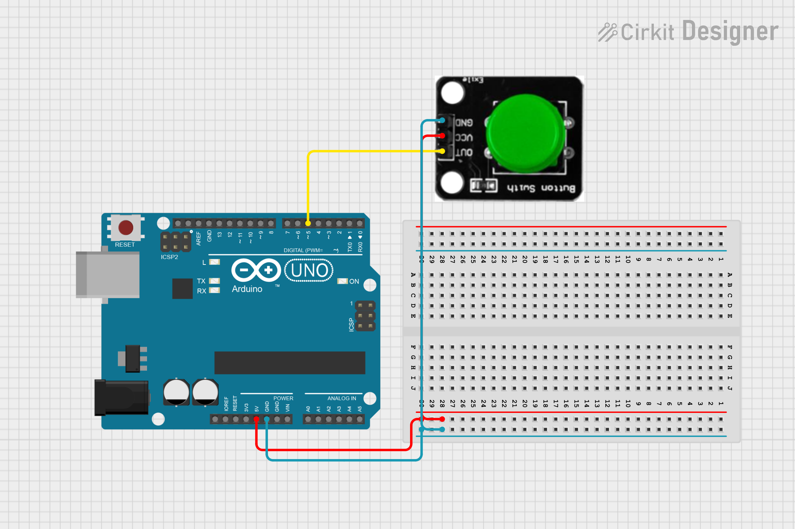

# Közlekedést irányító rendszer


## Közlekedési lámpa 🚥🚦

**📘 Leírás:** A mikrokontroller tanulása során gyakran használnak három LED-et – piros 🔴, zöld 🟢 és sárga 🟡 fényeket – a közlekedési lámpa villogásának szimulálására külső kapcsolatokkal.  

Ezúttal egy különleges modult terveztünk, amely nagyon kényelmes a bekötés szempontjából, és a modulon megtalálható a piros 🔴, sárga 🟡 és zöld 🟢 LED is.  

Ez a modul teljes mértékben kompatibilis az Arduino mikrokontrollerrel 🤖 és a Raspberry Pi rendszerrel 🍓.  

**⚙️ Specifikáció:**
- Működési feszültség: 3.3–5V 🔋
- Interfész típusa: digitális 📟
- Csatlakozó: PH2.54 🔌

**Kapcsolási rajz:**


**Példakód:**
``` cpp
////////////////////////////////////////////////////////////////////
int redled = 10; // initialize digital pin 10.
int yellowled = 9; // initialize digital pin 9.
int greenled = 8; // initialize digital pin 8.
void setup()
{
pinMode(redled, OUTPUT);// set the pin with red LED as “output”
pinMode(yellowled, OUTPUT); // set the pin with yellow LED as “output”
pinMode(greenled, OUTPUT); // set the pin with green LED as “output”
}
void loop()
{
digitalWrite(greenled, HIGH);//// turn on green LED
delay(5000);// wait 5 seconds
digitalWrite(greenled, LOW); // turn off green LED
for(int i=0;i<3;i++)// blinks for 3 times
{
delay(500);// wait 0.5 seconds
digitalWrite(yellowled, HIGH);// turn on yellow LED
delay(500);// wait 0.5 seconds
digitalWrite(yellowled, LOW);// turn off yellow LED
} 
delay(500);// wait 0.5 seconds
digitalWrite(redled, HIGH);// turn on red LED
delay(5000);// wait 5 seconds
digitalWrite(redled, LOW);// turn off red LED
}
////////////////////////////////////////////////////////////////////
```

## Gomb 🔘

**📘 Leírás:** Ez egy alap nyomógomb modul 🟠. Egyszerűen bedugható egy IO shield-be, így ideális az első Arduino próbálkozásokhoz 🤖.

**✨ Jellemzők:**
- Széles feszültségtartomány: 3.3V – 5V 🔋
- Könnyen felismerhető érzékelő interfészek – „A” az analóg, „D” a digitális jelekhez 📟
- Szabványos rögzítő furat 🔩
- Áttekinthető ikonokkal jelölve 👀
- Magas minőségű csatlakozó 🔌
- Egyszerűen csatlakoztatható és használható 🧩
- Nagyméretű gomb és strapabíró gombfedél 🔘
- Kiváló interaktív és kreatív projektekhez 🎮🎨

**⚙️ Specifikáció:**
- Tápfeszültség: 3.3V – 5V 🔋
- Interfész: Digitális 📟
- Méretek: 30 × 20 mm 📏
- Tömeg: 4 g ⚖️

**Kapcsolási rajz:**



**Példakód:**
``` cpp
////////////////////////////////////////////////////////////////////
/* # When you push the digital button, the Led on the board will be turned on. Otherwise,the led is turned off.
*/
int redled = 10; // initialize digital pin 10.
int yellowled = 9; // initialize digital pin 9.
int greenled = 8; // initialize digital pin 8.
int inputPin = 5;               // Connect sensor to input pin 5
void setup() {
  pinMode(redled, OUTPUT);      // set LED as output
  pinMode(yellowled, OUTPUT);
  pinMode(greenled, OUTPUT);
  pinMode(inputPin, INPUT);     // set pushbutton as input
}
void loop(){
  int val = digitalRead(inputPin);  // read input value
  if (val == HIGH) {            // check if the input is HIGH
    digitalWrite(redled, LOW);  // turn LED OFF
    digitalWrite(yellowled, LOW);
    digitalWrite(greenled, LOW);
  } else {
    digitalWrite(redled, HIGH); // turn LED ON
    digitalWrite(yellowled, HIGH);
    digitalWrite(greenled, HIGH);
  }
}
////////////////////////////////////////////////////////////////////
```

## Servo motor

**🧾 Bevezetés:**
A szervómotor egy pozícióvezérelt forgó működtető egység. ⚙️
Fő részei a következők:
- burkolat 🧱
- áramköri lap 🧩
- mag nélküli motor 🔄
- fogaskerekek ⚙️
- pozícióérzékelő 🎯

A szervómotorhoz különböző fehér motorfelfogató elemek tartoznak, amelyek a motor tengelyére rögzíthetők. ⚪🔩
A kívánt felfogatót szabadon választhatod ki az áramkörhöz. Ez vizuális segítségként szolgál, hogy könnyebben megfigyelhesd a motor forgását 🔁👀.

A szervón három csatlakozó található, amelyeket általában színkód különböztet meg (ez márkánként eltérhet):
- Barna – földelés (GND) 🟤⚡
- Piros – tápfeszültség (5V) 🔴🔌
- Narancssárga – vezérlő jel (PWM jel) 🟠📶

🔄 A szervó forgási szögének vezérlése
A szervó forgási szögét a PWM (Pulse-Width Modulation – impulzusszélesség-modulációs) jel kitöltési tényezőjének szabályozásával lehet vezérelni. 📶⚡
A PWM jel szabványos ciklusa 20 ms (azaz 50 Hz), a pulzusszélesség 1 ms és 2 ms között változik.
Ez a pulzusszélesség felel meg a forgási szögnek, ami általában 0°–90° között van. 🔁📏

**Kapcsolási rajz:**


**Példakód:**
``` cpp
//////////////////////////////////////////////////////////
int servopin= 6;// select digital pin 6 for servomotor signal line
int myangle;// initialize angle variable
int pulsewidth;// initialize width variable
int val;
void servopulse(int servopin,int myangle)// define a servo pulse function
{
pulsewidth=(myangle*11)+500;// convert angle to 500-2480 pulse width
digitalWrite(servopin,HIGH);// set the level of servo pin as “high”
delayMicroseconds(pulsewidth);// delay microsecond of pulse width
digitalWrite(servopin,LOW);// set the level of servo pin as “low”
delay(20-pulsewidth/1000);
}
void setup()
{
pinMode(servopin,OUTPUT);// set servo pin as “output”
Serial.begin(9600);// connect to serial port, set baud rate at “9600”
Serial.println("servo=o_seral_simple ready" ) ;
}
void loop()// convert number 0 to 9 to corresponding 0-180 degree angle, LED blinks corresponding number of time
{
val=Serial.read();// read serial port value
if(val>='0'&&val<='9')
{
val=val-'0';// convert characteristic quantity to numerical variable
val=val*(180/9);// convert number to angle
Serial.print("moving servo to ");
Serial.print(val,DEC);
Serial.println();
for(int i=0;i<=50;i++) // giving the servo time to rotate to commanded position
{
servopulse(servopin,val);// use the pulse function
}
}
}
//////////////////////////////////////////////////////////
```

# A végleges rendszer

**Leírás:** Hozz létre egy rendszert, ami képes irányítani lámpát 🏮, lámpa párokat 🔴🟢 és egy klassz sorompót 🚧

🛠️ Eszközök, amikre szükséged lesz:
- Lámpák 🏮 ( ebből lehet 1-2 db attól függően, mennyire összetett )
- Gomb 🔘
- Micro servo 9g motor 🔧

**Kapcsolási rajz:**


# Extra feladat:
