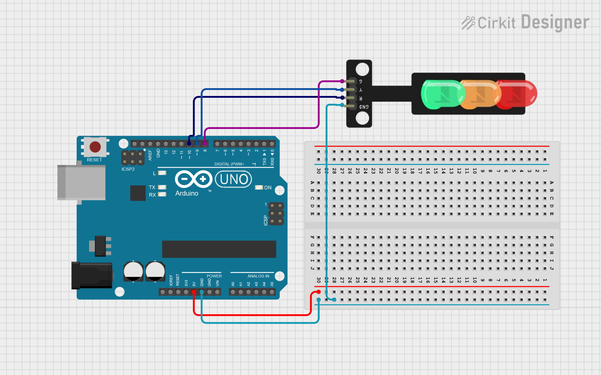

# Közlekedést irányító rendszer


🎯Feladat: Hozz létre egy rendszert, ami képes irányítani lámpát 🏮, lámpa párokat 🔴🟢 és egy klassz sorompót 🚧

🛠️ Eszközök, amikre szükséged lesz:
- Lámpák 🏮 ( ebből lehet 1-2 db attól függően, mennyire összetett )
- Gomb 🔘
- Micro servo 9g motor 🔧

## Közlekedési lámpa 🚥🚦

**📘 Leírás:**  
A mikrokontroller tanulása során gyakran használnak három LED-et – piros 🔴, zöld 🟢 és sárga 🟡 fényeket – a közlekedési lámpa villogásának szimulálására külső kapcsolatokkal.  

Ezúttal egy különleges modult terveztünk, amely nagyon kényelmes a bekötés szempontjából, és a modulon megtalálható a piros 🔴, sárga 🟡 és zöld 🟢 LED is.  

Ez a modul teljes mértékben kompatibilis az Arduino mikrokontrollerrel 🤖 és a Raspberry Pi rendszerrel 🍓.  

**⚙️ Specifikáció:**
- Működési feszültség: 3.3–5V 🔋
- Interfész típusa: digitális 📟
- Csatlakozó: PH2.54 🔌

**Kapcsolási rajz:**



**Példakód:**
``` cpp
////////////////////////////////////////////////////////////////////
int redled =5; // initialize digital pin 5.
int yellowled =4; // initialize digital pin 4.
int greenled =3; // initialize digital pin 3.
void setup()
{
pinMode(redled, OUTPUT);// set the pin with red LED as “output”
pinMode(yellowled, OUTPUT); // set the pin with yellow LED as “output”
pinMode(greenled, OUTPUT); // set the pin with green LED as “output”
}
void loop()
{
digitalWrite(greenled, HIGH);//// turn on green LED
delay(5000);// wait 5 seconds
digitalWrite(greenled, LOW); // turn off green LED
for(int i=0;i<3;i++)// blinks for 3 times
{
delay(500);// wait 0.5 seconds
digitalWrite(yellowled, HIGH);// turn on yellow LED
delay(500);// wait 0.5 seconds
digitalWrite(yellowled, LOW);// turn off yellow LED
} 
delay(500);// wait 0.5 seconds
digitalWrite(redled, HIGH);// turn on red LED
delay(5000);// wait 5 seconds
digitalWrite(redled, LOW);// turn off red LED
}
////////////////////////////////////////////////////////////////////
```

## 
