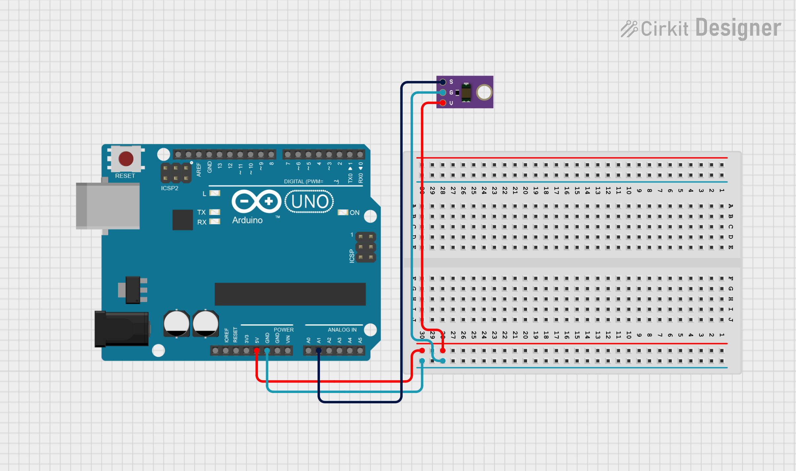
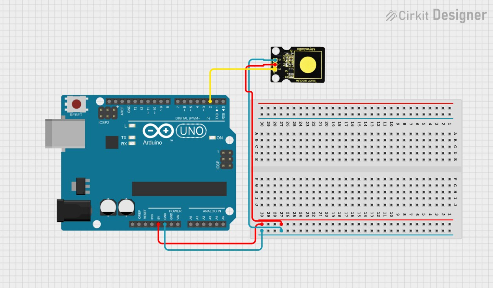
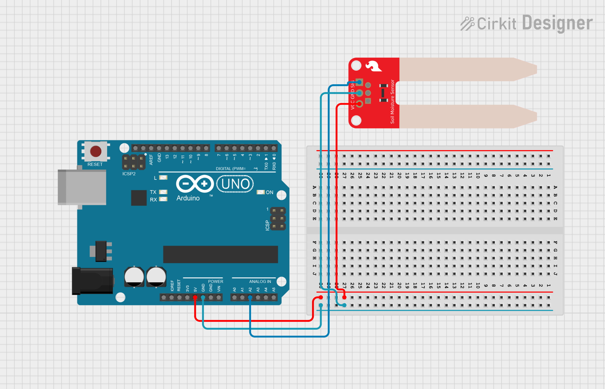

# Növénygondozó


---
## Vízszint érzékelő

📄 Leírás

A Keyestudio vízérzékelő egy könnyen használható, hordozható és költséghatékony eszköz 💧, amelyet vízszint és vízcsepp felismerésére terveztek.

Ez a kis érzékelő képes a vízcseppek mennyiségét vagy a víz mennyiségét mérni egy sor, párhuzamosan elhelyezett, csupasz vezeték nyomon keresztül 🧪.

⭐ Jellemzők
- Zökkenőmentes átváltás a vízmennyiség és az analóg érték között 🔁
- Nagyfokú rugalmasság, egyszerű analóg érték kimenet 🔧
- Alacsony energiafogyasztás és nagy érzékenység ⚡👃
- Közvetlenül csatlakoztatható mikrokontrollerhez vagy más logikai áramkörökhöz 🤖

Támogatja többek között az Arduino-t, STC mikrovezérlőt, AVR mikrovezérlőt és egyéb fejlesztői platformokat 🧠🔌

📐 Műszaki adatok
- ⚡ Működési feszültség: DC 5V
- 🔌 Működési áram: < 20mA
- 🎛️ Érzékelő típusa: Analóg
- 📏 Érzékelési terület: 40mm × 16mm
- 🛠️ Gyártási technológia: FR4, kétoldalas ónbevonat
- 🌀 Forma kialakítása: Csúszásgátló, félhold alakú mélyedés
- 🌡️ Üzemi hőmérséklet: 10℃ – 30℃
- 💧 Üzemi páratartalom: 10% – 90% (kondenzáció nélkül)
- ⚖️ Tömeg: 3g
- 📦 Méret: 65mm × 20mm × 8mm

Kapcsolási rajz:


Példakód:
``` cpp
int led = 13; 
int val = 0; 
int data = 0; 

void setup()
{
  pinMode(led, OUTPUT); 
  Serial.begin(9600); 
}
void loop()
{
  val = analogRead(0); 

  if(val>700)
  {  
    digitalWrite(led,HIGH);
  }  
  else {
    digitalWrite(led,LOW); 
  }
  data = val; 

  if (data > 0) {
    Serial.println("Eső van! ");
    Serial.println(data); 
  }
  else {
    Serial.println("Száraz az idő! ");
    Serial.println(data);
  }

  delay(1000);
}
```

## Környezeti fényérzékelő

💡 Leírás

Előbb-utóbb szükséged lesz arra, hogy a környezeti fényerőt nagyobb pontossággal érzékeld, mint amit egy hagyományos fényellenállás (LDR) nyújt – anélkül, hogy bonyolultabbá tennéd a projektedet ⚙️🌞.  
Amikor ez elérkezik, érdemes beszerezned egy TEMT6000 környezeti fényérzékelőt 📦🔦.

A TEMT6000 érzékenysége az emberi szem működéséhez van hangolva 👁️✨, de gyenge fényviszonyok között kevésbé teljesít jól 🌑.  
Ugyanakkor kiválóan érzékeli az apró fényváltozásokat egy széles fényerőtartományon belül 🌗➡️🌕.

Mivel az emberi szemhez hasonlóan működik, nem reagál jól az infravörös (IR) vagy UV fényre 🔴❌🟣 – ezt tartsd szem előtt a projekted tervezésénél.

📐 Műszaki adatok
- ⚡ Tápfeszültség: +5V DC, 50mA
- 📏 Méret: 36.5 × 16 mm
- ⚖️ Tömeg: 4g

Kapcsolási rajz:



Példakód:
``` cpp
int temt6000Pin = 0;

void setup() {
  Serial.begin(9600);
}
void loop() {

 int value = analogRead(temt6000Pin);

 if (value < 2)
 {
    Serial.print("Sötét van! - ");
    Serial.println(value);
 }
 else if (value > 2 && value < 50)
 {
    Serial.print("Normál fényerősség! - ");
    Serial.println(value);
 }
 else
 {
    Serial.print("Túl világos van! - ");
    Serial.println(value);
 }

 delay(1000); 
}
```

## Érintés érzékelő

📄 Leírás

Unod már a mechanikus gombok nyomkodását? 🤯 Próbáld ki a kapacitív érintésérzékelőnket! 👆
Az érintésérzékelők gyakran megtalálhatók különféle elektronikai eszközökben – most pedig a saját Arduino projektedet is feldobhatod vele! 🚀✨

Ez a kis szenzor érzékeli az emberi test vagy fém érintését, és HIGH/LOW jelszinttel jelez vissza. ⚡
Még akkor is működik, ha vékony ruhával 👕 vagy papírral 📄 van elválasztva – bár a érzékenység csökken, ha a szigetelő réteg túl vastag lesz.

📈 Folyamatosan fejlesztjük ezeket a szenzormodulokat, hogy még jobb élményt nyújtsanak számodra!

⚙️ Műszaki adatok
- 🔋 Tápfeszültség: 3.3V – 5V
- 🔌 Interfész: Digitális (Digital)
- 📏 Méret: 30 x 20 mm
- ⚖️ Tömeg: 3 g

Kapcsolási rajz:



Példakód:
``` cpp
int ledPin = 8;

int KEY = 2;

void setup()
{
  pinMode(ledPin, OUTPUT);
  pinMode(KEY, INPUT);
}
void loop()
{
  if(digitalRead(KEY)==LOW) 
  {
  digitalWrite(ledPin, HIGH);
  }
  else
  {
    digitalWrite(ledPin, LOW);
  }
}
```

## Talajnedvesség érzékelő

🌱 Leírás – Talajnedvesség-érzékelő

Ez egy egyszerű talajnedvesség-érzékelő, amely arra szolgál, hogy észlelje a talaj nedvességtartalmát 💧.
Ha a talaj száraz, a szenzor által kiadott analóg érték csökken, ha pedig nedves, akkor az érték növekszik 📉📈.

Ez a szenzor ideális például automata öntözőrendszerhez, mivel képes megállapítani, hogy a növényed "szomjas-e", így megelőzhető a kiszáradása, amikor nem vagy otthon 🌿🚿.

Ha ezt az érzékelőt egy Arduino vezérlővel kombinálod 🤖, akkor a növényed kényelmesebben "érzi magát", és a kerted is okosabbá válik 🌼📲.

A szenzor használata egyszerűbb, mint gondolnád!
Ha a projektedhez talajérzékelésre van szükség, ez tökéletes választás lesz ✔️🪴.

⚙️ Működés

Az érzékelőn két fém szonda található, amelyeket a földbe kell szúrni 🧪🌍.  
Ha áram halad át a talajon, a szenzor ellenállásértéket mér, majd ebből számolja ki a nedvességtartalmat 📊.
- Minél nedvesebb a talaj → annál kisebb az ellenállás → annál nagyobb a vezetőképesség ⚡.
- A szenzor felülete fémbevonatot kapott, hogy hosszabb legyen az élettartama 🛡️.

Használata egyszerű: szúrd a földbe, és olvasd be az értéket az Arduino AD átalakítóján keresztül (analóg bemenet) 📥📟.

A növény pedig szinte "szól neked":
- 🌼 „Vizet kérek!”
- 📐 Műszaki adatok
- 🔋 Tápfeszültség: 3.3V vagy 5V
- ⚡ Működési áram: ≤ 20 mA
- 📤 Kimeneti feszültség: 0 – 2.3V

(Ha a szenzor teljesen vízbe van merítve, az érték kb. 2.3V)

Minél nedvesebb a talaj, annál magasabb a kimeneti feszültség
- 🧪 Szenzortípus: Analóg kimenet
- 🔌 Lábkiosztás:
- Pin1 → Jel (Signal)
- Pin2 → GND (Föld)
- Pin3 → VCC (Táp)

Kapcsolási rajz:



Példakód:
``` cpp
const int sensorPin = A2;  

void setup() {
  Serial.begin(9600);
}

void loop() {
  int val = analogRead(sensorPin);  // csak egyszer olvasd be

  if (val < 300) {
    Serial.print("Száraz a föld, locsolni kell! - ");
  }
  else if (val >= 300 && val < 700) {
    Serial.print("Ideális állapot, nincs szükség locsolásra. - ");
  }
  else {
    Serial.print("Túl sok a víz, távolítsd el! - ");
  }

  Serial.println(val);  // és ezt az értéket írd ki
  delay(1000);
}

```

## 


