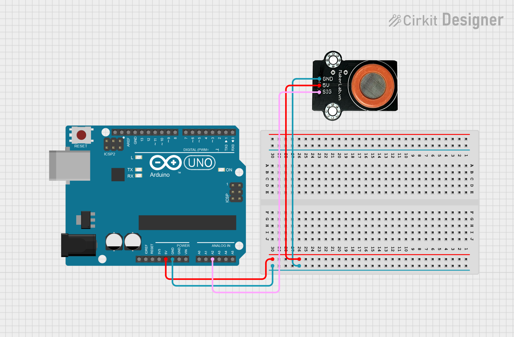

# OkosÓra - Egészségügyi monitor


---
## Fehér led

📄 Leírás

Ez a fehér LED fény modul tökéletes választás Arduino kezdők számára. 🚀  
Könnyedén csatlakoztatható IO/Szenzor shieldhez, és lehetővé teszi fényhez kapcsolódó interaktív projektek megvalósítását. 💡✨

📝 Megjegyzés:
Más színű LED modulokat is választhatsz, például:
🟡 sárga, 🔴 piros, 🟢 zöld vagy 🔵 kék fényű változatot.

⚙️ Műszaki adatok
- 💡 Fehér LED modul
- 🔢 Típus: Digitális
- 🔌 Csatlakozó: PH2.54 aljzat
- 📏 Méret: 30 × 20 mm
- ⚖️ Tömeg: 3 g

Kapcsolási rajz:


Példakód:
``` cpp
int buzzPin = 7;    //Connect Buzzer on Digital Pin7
 void setup()  
 {        
  pinMode(buzzPin, OUTPUT);     
}
 void loop()                     
{
  digitalWrite(buzzPin, HIGH);
  delay(1000);
  digitalWrite(buzzPin, LOW); 
  delay(1000);        
}
```
## Pulzusmérő

📄 Leírás
Ez a modul egy nagyon tiszta infravörös LED-et 💡 és egy fototranzisztort 📷 használ arra, hogy észlelje az ujjadban lévő pulzust.

🫀 A piros LED a pulzusod ritmusára fog villogni!

⚙️ Működési elv
🔦 A fényes LED az ujjad egyik oldalára világít, miközben a fototranzisztor az ujjad másik oldalán méri, hogy mennyi fény jut át rajta.

🩸 Amikor a vér lüktet az ujjadon keresztül, a fototranzisztor ellenállása enyhén változik.
Ez a kis változás teszi lehetővé a pulzus észlelését.

Kapcsolási rajz:


Példakód:
``` cpp
int ledPin = 13;
int sensorPin = 0;
double alpha = 0.75;
int period = 20;
double change = 0.0;

void setup()
{
 pinMode(ledPin, OUTPUT);
 Serial.begin(9600);
}
void loop()
{
 static double oldValue = 0;
 static double oldChange = 0;
 int rawValue = analogRead(sensorPin);
 double value = alpha * oldValue + (1 - alpha) * rawValue;
 Serial.print(rawValue);
 Serial.print(",");
 Serial.println(value);
 oldValue = value;
 delay(period);
}
```

## Hőmérséklet mérő

🌡️ Bevezetés

Az LM35 lineáris hőmérséklet-érzékelő egy félvezető alapú szenzor, amely az LM35 típusú hőmérséklet-érzékelőre épül. 🧊🌬️
Ez a modul környezeti hőmérséklet mérésére alkalmas.

🌡️ A szenzor működési tartománya 0°C és 100°C között van.
🎯 Érzékenysége: 10 mV minden egyes Celsius-fok növekedésre.
⚡ A kimeneti feszültség arányos a mért hőmérséklettel.

🔬 Használati információk

Ez az érzékelő általánosan használt hőmérsékletmérő eszköz.

A hőmérsékletmérés területén gyakran alkalmazott típusok:
- 🌡️ Termoelemek
- 🧪 Platina ellenállás
- 🧊 Termikus ellenállás
- 💾 Félvezető hőmérsékletmérő chipek

A LM35 érzékelő előnye:
- 📈 Kiváló linearitás
- 🎯 Magas érzékenység
- ⚙️ Egyszerű csatlakozás Arduino-hoz (például szenzor shieldhez)

⚙️ Műszaki adatok
- 📏 Érzékenység: 10 mV / °C
- 🌡️ Mérési tartomány: 0°C – 100°C
- 📐 Méret: 30 × 20 mm
- ⚖️ Tömeg: 3 g


Kapcsolási rajz:


Példakód:
``` cpp
float temppin = A1;

void setup() {
  Serial.begin(9600);
}

void loop() {

  float tempC = analogRead(temppin) * (500.0 / 1023.0);

  Serial.print("Temp: ");
  Serial.print(tempC);
  Serial.println(" C");

  delay(500);
}
```
> Az érték nem bitos, hogy a valóságot mutatja!

## Alkoholszenzor

🍷 Leírás

Ez az analóg MQ3 szenzor kiválóan alkalmas alkohol jelenlétének érzékelésére.
Gyakran használják például lehelet-alkoholmérőkben. 😮‍💨🧪

🧠 Jó szelektivitással rendelkezik:

- 🔍 Magas érzékenység az alkoholra
- 🚫 Alacsony érzékenység a benzolra (benzine)

A szenzor érzékenysége állítható a rajta található kis potméter (tekerő) segítségével. 🔧

📋 Műszaki adatok

- ⚡ Tápfeszültség: 5V
- 📶 Interfész típusa: Analóg
- 🧰 Egyszerű meghajtó áramkör
- 🕒 Stabil és hosszú élettartam
- ⚡ Gyors válaszidő és magas érzékenység


Kapcsolási rajz:



Példakód:
``` cpp
//Arduino Sample Code
void setup()
{
  Serial.begin(9600); //Set serial baud rate to 9600 bps
}
void loop()
{
int val;
val=analogRead(2);//Read Gas value from analog 0
Serial.println(val,DEC);//Print the value to serial port
delay(100);
}
```

## Mátrix led

💡 Bevezetés – 8×8 LED mátrix (HT16K33 vezérlővel)

Mi lehet jobb egyetlen LED-nél? Sok LED!😄
Egy szórakoztató és látványos módja a kijelzőkészítésnek az, ha egy 8×8-as LED mátrixot használsz.
Ez a modul a HT16K33 chipet használja a mátrix meghajtására. 🔲✨

📡 A mátrix vezérléséhez csak az I2C kommunikációs portot kell használnod, így rengeteg mikrokontrolleres portot szabadon hagyhatsz más célra. 👍

A modul egy 4 tűs csatlakozófejjel érkezik, amelynek lábköze 2.54 mm, így könnyen csatlakoztatható jumperkábelekkel. 🔌

⚙️ Extra lehetőség

A modulon található három DIP kapcsoló is, melyekkel szabadon állíthatod be az I2C-címet. Ez lehetővé teszi, hogy akár több mátrixmodult is használj egyazon projekten belül, összeakadás nélkül. 🔁🔧

📋 Műszaki adatok

- 🔌 Interfész: 4 tűs csatlakozó (2.54mm)
- ⚡ Üzemi feszültség: DC 4.5V – 5.5V
- 🎛️ 3 db DIP kapcsoló az I2C-cím kiválasztásához
- 📐 Méretek: 52 mm × 34 mm × 11 mm
- ⚖️ Tömeg: 13.2 g


Kapcsolási rajz:


Példakód:
``` cpp
#include <Wire.h>
#include "Adafruit_LEDBackpack.h"
#include "Adafruit_GFX.h"
#ifndef _BV
#define _BV(bit) (1<<(bit))
#endif
Adafruit_LEDBackpack matrix = Adafruit_LEDBackpack();
uint8_t counter = 0;
void setup() {
  Serial.begin(9600);
  Serial.println("HT16K33 test");
  matrix.begin(0x70);  // pass in the address
}
void loop() {
  // paint one LED per row. The HT16K33 internal memory looks like
  // a 8x16 bit matrix (8 rows, 16 columns)
  for (uint8_t i=0; i<8; i++) {
// draw a diagonal row of pixels

    matrix.displaybuffer[i] = _BV((counter+i) % 16) | _BV((counter+i+8) % 16)  ;
  }
  // write the changes we just made to the display
  matrix.writeDisplay();
  delay(100);
 counter++;
  if (counter >= 16) counter = 0;  
}
```

---
# Teljes rendszer


# Extra feladat
