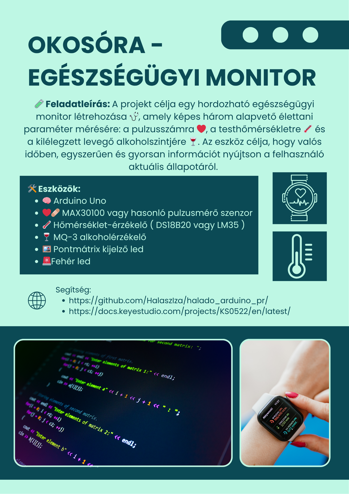
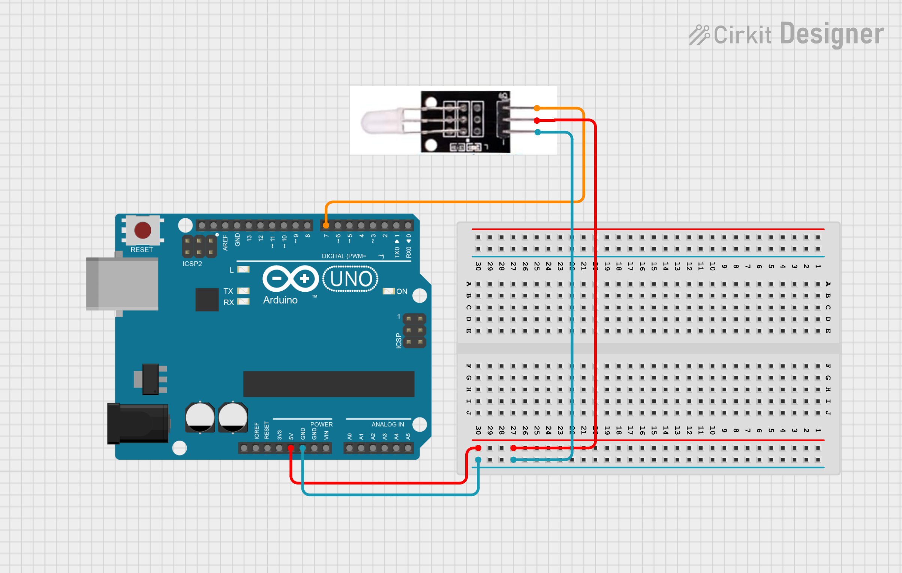
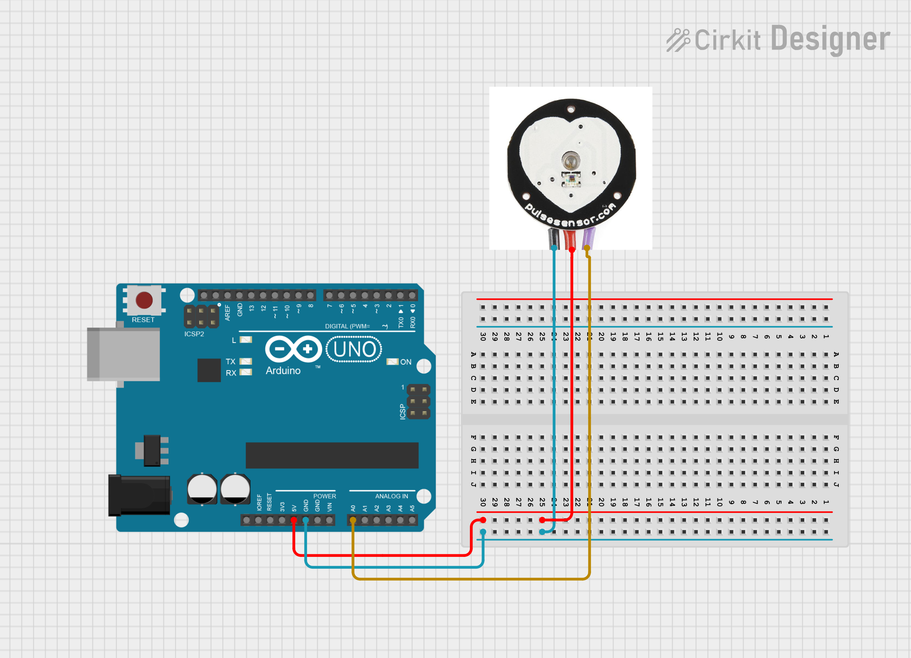
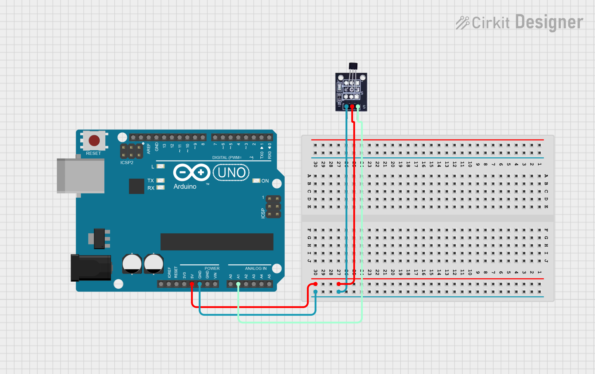

# OkosÓra - Egészségügyi monitor



---
## Fehér led

📄 Leírás

Ez a fehér LED fény modul tökéletes választás Arduino kezdők számára. 🚀  
Könnyedén csatlakoztatható IO/Szenzor shieldhez, és lehetővé teszi fényhez kapcsolódó interaktív projektek megvalósítását. 💡✨

📝 Megjegyzés:
Más színű LED modulokat is választhatsz, például:
🟡 sárga, 🔴 piros, 🟢 zöld vagy 🔵 kék fényű változatot.

⚙️ Műszaki adatok
- 💡 Fehér LED modul
- 🔢 Típus: Digitális
- 🔌 Csatlakozó: PH2.54 aljzat
- 📏 Méret: 30 × 20 mm
- ⚖️ Tömeg: 3 g

Kapcsolási rajz:



Példakód:
``` cpp
int buzzPin = 7;    //Connect Buzzer on Digital Pin7
 void setup()  
 {        
  pinMode(buzzPin, OUTPUT);     
}
 void loop()                     
{
  digitalWrite(buzzPin, HIGH);
  delay(1000);
  digitalWrite(buzzPin, LOW); 
  delay(1000);        
}
```
## Pulzusmérő

📄 Leírás
Ez a modul egy nagyon tiszta infravörös LED-et 💡 és egy fototranzisztort 📷 használ arra, hogy észlelje az ujjadban lévő pulzust.

🫀 A piros LED a pulzusod ritmusára fog villogni!

⚙️ Működési elv
🔦 A fényes LED az ujjad egyik oldalára világít, miközben a fototranzisztor az ujjad másik oldalán méri, hogy mennyi fény jut át rajta.

🩸 Amikor a vér lüktet az ujjadon keresztül, a fototranzisztor ellenállása enyhén változik.
Ez a kis változás teszi lehetővé a pulzus észlelését.

Kapcsolási rajz:



Példakód:
``` cpp
int ledPin = 13;
int sensorPin = 0;
double alpha = 0.75;
int period = 20;
double change = 0.0;

void setup()
{
 pinMode(ledPin, OUTPUT);
 Serial.begin(9600);
}
void loop()
{
 static double oldValue = 0;
 static double oldChange = 0;
 int rawValue = analogRead(sensorPin);
 double value = alpha * oldValue + (1 - alpha) * rawValue;
 Serial.print(rawValue);
 Serial.print(",");
 Serial.println(value);
 oldValue = value;
 delay(period);
}
```

## Hőmérséklet mérő

🌡️ Bevezetés

Az LM35 lineáris hőmérséklet-érzékelő egy félvezető alapú szenzor, amely az LM35 típusú hőmérséklet-érzékelőre épül. 🧊🌬️
Ez a modul környezeti hőmérséklet mérésére alkalmas.

🌡️ A szenzor működési tartománya 0°C és 100°C között van.
🎯 Érzékenysége: 10 mV minden egyes Celsius-fok növekedésre.
⚡ A kimeneti feszültség arányos a mért hőmérséklettel.

🔬 Használati információk

Ez az érzékelő általánosan használt hőmérsékletmérő eszköz.

A hőmérsékletmérés területén gyakran alkalmazott típusok:
- 🌡️ Termoelemek
- 🧪 Platina ellenállás
- 🧊 Termikus ellenállás
- 💾 Félvezető hőmérsékletmérő chipek

A LM35 érzékelő előnye:
- 📈 Kiváló linearitás
- 🎯 Magas érzékenység
- ⚙️ Egyszerű csatlakozás Arduino-hoz (például szenzor shieldhez)

⚙️ Műszaki adatok
- 📏 Érzékenység: 10 mV / °C
- 🌡️ Mérési tartomány: 0°C – 100°C
- 📐 Méret: 30 × 20 mm
- ⚖️ Tömeg: 3 g


Kapcsolási rajz:



Példakód:
``` cpp
float temppin = A1;

void setup() {
  Serial.begin(9600);
}

void loop() {

  float tempC = analogRead(temppin) * (500.0 / 1023.0);

  Serial.print("Temp: ");
  Serial.print(tempC);
  Serial.println(" C");

  delay(500);
}
```
> Az érték nem bitos, hogy a valóságot mutatja!

## Alkoholszenzor


## Mátrix led


---
# Teljes rendszer


# Extra feladat
