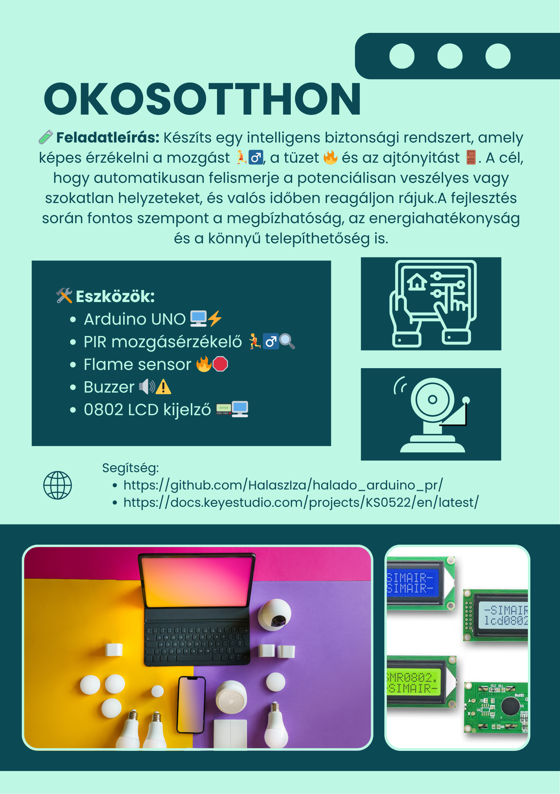
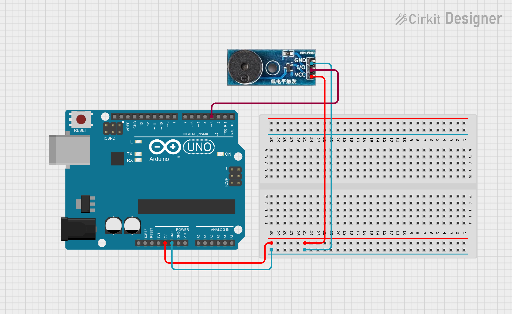

# OkosOtthon



> Linkek: https://docs.keyestudio.com/projects/KS0522/en/latest/KS0522.html#projects

---
## Csipogó

Leírás 🔊  
Ez az egyik legegyszerűbb hangkeltő modul 🧩, amelyet könnyedén vezérelhetsz magas (HIGH) vagy alacsony (LOW) jelszinttel ⚡. A kimeneti frekvencia változtatásával különböző hangokat tudsz létrehozni 🎶.

Ez a modul széles körben elterjedt a mindennapi eszközeinkben, például számítógépekben 🖥️, hűtőszekrényekben 🧊, telefonokban 📱 és sok más készülékben.

Emellett rengeteg izgalmas, interaktív projektet is készíthetsz ezzel a kis, de hasznos eszközzel 🤖🎮. Próbáld ki, és garantáltan lenyűgöz majd az általa keltett elektronikus hang! 🧠✨

Specifikáció ⚙️
- Működési feszültség: 3.3–5V ⚡
- Interfész típusa: digitális 💻
- Méret: 30 × 20 mm 📏
- Tömeg: 4 g ⚖️

Kapcsolási rajz:



Példakód:
``` cpp
////////////////////////////////////////////////////////////////////
int buzzPin = 3;  // Buzzer csatlakoztatva a 3-as digitális pinre

void setup() {
  // Nincs szükség pinMode beállításra a tone() használatakor
}

void loop() {
  tone(buzzPin, 1000);  // 1000 Hz-es hangot játszik (kb. középtartomány)
  delay(500);           // fél másodpercig szól
  noTone(buzzPin);      // hang leállítása
  delay(500);           // fél másodperc szünet
}
////////////////////////////////////////////////////////////////////
```

## RGB Led

Leírás 📘

Ez egy teljes színskálás LED modul 🌈, amely három alapszínt tartalmaz – piros 🔴, zöld 🟢 és kék 🔵. Ezek különálló LED fényekként láthatók.

Programozás után a LED-eket sorrendben be- és kikapcsolhatod 💡, vagy PWM (impulzusszélesség-moduláció) analóg kimenetet is használhatsz arra, hogy a három színt összekeverve különböző színeket hozz létre 🎨.

Specifikáció ⚙️
- Színek: piros 🔴, zöld 🟢, kék 🔵
- Fényerő: magas ✨
- Feszültség: 5V 🔌
- Bemenet: digitális szint 💻
- Méret: 30 × 20 mm 📏
- Tömeg: 3g ⚖️

Kapcsolási rajz:


Példakód:
``` cpp
///////////////////////////////////////////////////////////
int redpin = 13;   // Piros LED a 13-as lábra kötve
int greenpin = 12; // Zöld LED a 12-es lábra kötve

void setup() {
  pinMode(redpin, OUTPUT);
  pinMode(greenpin, OUTPUT);
}

void loop() {
  digitalWrite(redpin, HIGH);   // Piros LED bekapcsol
  digitalWrite(greenpin, LOW);  // Zöld LED kikapcsol
  delay(1000);                  // Vár 1 másodpercet

  digitalWrite(redpin, LOW);    // Piros LED kikapcsol
  digitalWrite(greenpin, HIGH); // Zöld LED bekapcsol
  delay(1000);                  // Vár 1 másodpercet
}


///////////////////////////////////////////////////////////
```
> A piros 🔴 és a zöld 🟢 szín elég lesz a feladathoz!

## Mozgásérzékelő

Leírás 🕵️‍♂️  
A piroelektromos infravörös mozgásérzékelő képes érzékelni az emberi vagy állati mozgásból származó infravörös jeleket 🧍🐕🌡️, és kapcsolójelet ad ki (HIGH vagy LOW) ⚡.

Széles körben alkalmazható olyan helyeken, ahol emberi mozgás érzékelésére van szükség 🏠🚪🔐.

A hagyományos piroelektromos szenzorok általában nagyobb méretűek, mivel szükséges hozzájuk külön érzékelő, speciális chip és bonyolult perifériás áramkörök 🧩🔌, így megbízhatóságuk is alacsonyabb lehet.

Ez az új piroelektromos mozgásérzékelő kifejezetten Arduinohoz lett tervezve 🤖📦. Beépített digitális érzékelőt használ, kisebb mérettel, nagyobb megbízhatósággal ✅, alacsonyabb energiafogyasztással 🔋, és egyszerűbb áramköri kialakítással 🧠.

Specifikáció ⚙️
- Bemeneti feszültség: 3.3V – 5V (max: 6V) ⚡
- Működési áram: 15 μA 🔌
- Üzemi hőmérséklet: -20 ℃ – 85 ℃ ❄️🔥
- Kimeneti feszültség: HIGH = 3V, LOW = 0V 🔄
- Kimeneti késleltetés (HIGH szint): kb. 2.3–3 másodperc ⏱️
- Érzékelési szög: 100° 🧭
- Érzékelési távolság: akár 7 méter 📏
- Kimeneti LED-jelző: világít, ha a kimenet HIGH 💡
- Lábankénti áramkorlát: max. 100 mA ⚠️
- Méret: 30 × 20 mm 📐
- Tömeg: 4 g ⚖️

Példakód:
``` cpp
////////////////////////////////////////////////////////////////////
byte sensorPin = 3;
byte indicator = 13;
void setup()
{
  pinMode(sensorPin,INPUT);
  pinMode(indicator,OUTPUT);
  Serial.begin(9600);
}

void loop()
{
  byte state = digitalRead(sensorPin);
  digitalWrite(indicator,state);
  if(state == 1)Serial.println("Somebody is in this area!");
  else if(state == 0)Serial.println("No one!");
  delay(500);
}
////////////////////////////////////////////////////////////////////
```

## Füstérzékelő

Leírás 🔥

Ez a lángérzékelő képes érzékelni a tüzet vagy más fényforrásokat, amelyek hullámhossza 760 nm és 1100 nm között van 🌈.
A tűzoltó robot játékokban a láng kulcsszerepet játszik a felderítésben 🤖🚒, mivel az érzékelő a robot "szemeként" működik, segítve a tűzforrás megtalálását 👀🔥.

Specifikáció ⚙️
- Tápfeszültség: 3.3V – 5V ⚡
- Érzékelési tartomány: 20 cm (4.8V) ~ 100 cm (1V) 📏
- Spektrális érzékenységi tartomány: 760 nm – 1100 nm 🌐
- Működési hőmérséklet: -25℃ – 85℃ ❄️🌡️🔥
- Interfész: digitális 💻
- Méret: 44 × 16,7 mm 📐
- Tömeg: 4 g ⚖️

Példakód:
``` cpp
////////////////////////////////////////////////////////////////////
const int flamePin = 2;     // the number of the flame pin
const int buzzPin =  13;      // the number of the BUZZER pin

// variables will change:
int State = 0;         // variable for reading status
void setup()
{
  // initialize the BUZZER pin as an output:
  pinMode(buzzPin, OUTPUT);      
  // initialize the pushbutton pin as an input:
  pinMode(flamePin, INPUT);     
}
void loop()
{
  // read the state of the value:
State = digitalRead(flamePin);
  if (State == HIGH) {     
    // turn BUZZER on:    
    digitalWrite(buzzPin, HIGH);  
  } 
  else {
    // turn BUZZER off:
    digitalWrite(buzzPin, LOW); 
  }
}
////////////////////////////////////////////////////////////////////
```

## Kijelző


