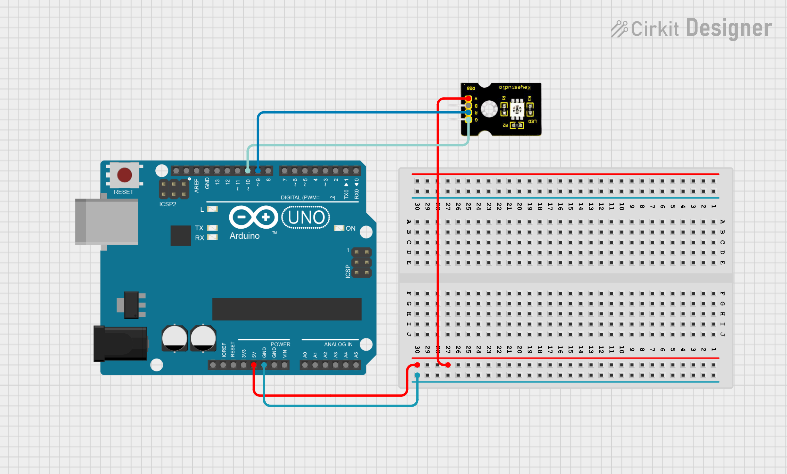
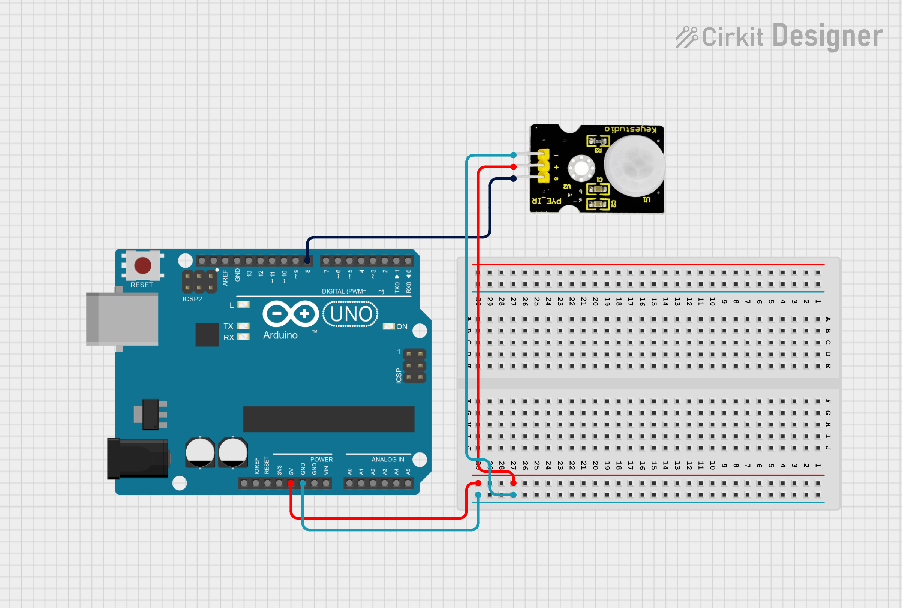
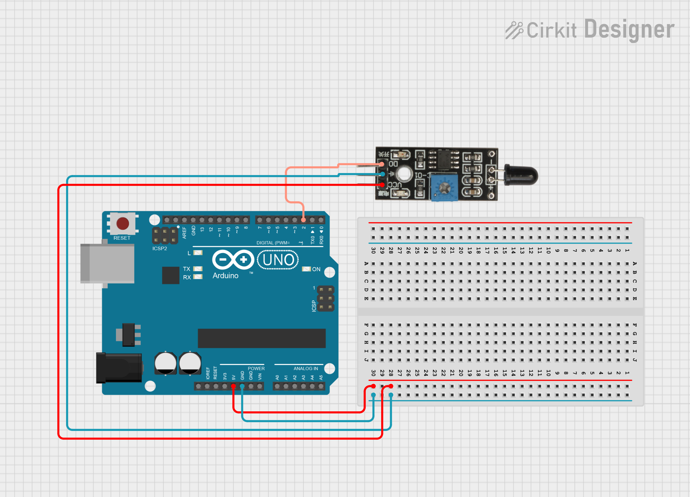
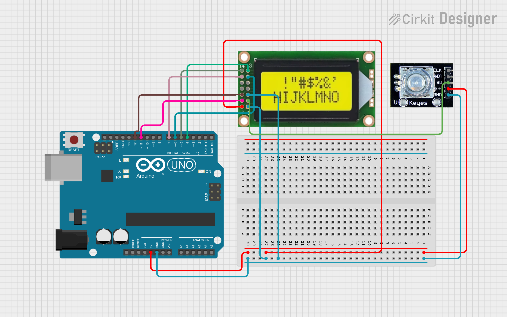
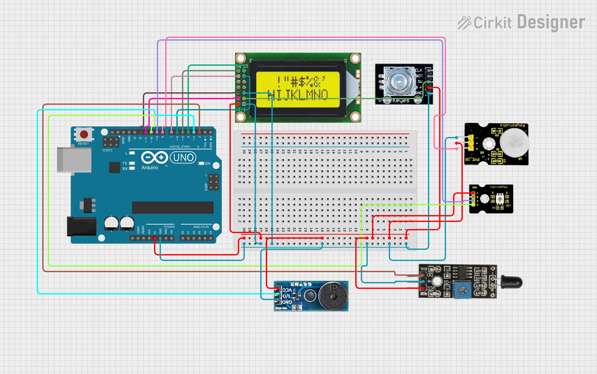

# OkosOtthon


> Linkek: https://docs.keyestudio.com/projects/KS0522/en/latest/KS0522.html#projects

---
## Csipogó

Leírás 🔊  
Ez az egyik legegyszerűbb hangkeltő modul 🧩, amelyet könnyedén vezérelhetsz magas (HIGH) vagy alacsony (LOW) jelszinttel ⚡. A kimeneti frekvencia változtatásával különböző hangokat tudsz létrehozni 🎶.

Ez a modul széles körben elterjedt a mindennapi eszközeinkben, például számítógépekben 🖥️, hűtőszekrényekben 🧊, telefonokban 📱 és sok más készülékben.

Emellett rengeteg izgalmas, interaktív projektet is készíthetsz ezzel a kis, de hasznos eszközzel 🤖🎮. Próbáld ki, és garantáltan lenyűgöz majd az általa keltett elektronikus hang! 🧠✨

Specifikáció ⚙️
- Működési feszültség: 3.3–5V ⚡
- Interfész típusa: digitális 💻
- Méret: 30 × 20 mm ğŸ“
- Tömeg: 4 g ⚖️

Kapcsolási rajz:


Példakód:
``` cpp
////////////////////////////////////////////////////////////////////
int buzzPin = 3;  // Buzzer csatlakoztatva a 3-as digitális pinre

void setup() {
  // Nincs szükség pinMode beállításra a tone() használatakor
}

void loop() {
  tone(buzzPin, 1000);  // 1000 Hz-es hangot játszik (kb. középtartomány)
  delay(500);           // fél másodpercig szól
  noTone(buzzPin);      // hang leállítása
  delay(500);           // fél másodperc szünet
}
////////////////////////////////////////////////////////////////////
```

## RGB Led

Leírás 📘

Ez egy teljes színskálás LED modul 🌈, amely három alapszínt tartalmaz – piros 🔴, zöld 🟢 és kék 🔵. Ezek különálló LED fényekként láthatók.

Programozás után a LED-eket sorrendben be- és kikapcsolhatod 💡, vagy PWM (impulzusszélesség-moduláció) analóg kimenetet is használhatsz arra, hogy a három színt összekeverve különböző színeket hozz létre 🎨.

Specifikáció ⚙️
- Színek: piros 🔴, zöld 🟢, kék 🔵
- Fényerő: magas ✨
- Feszültség: 5V 🔌
- Bemenet: digitális szint 💻
- Méret: 30 × 20 mm ğŸ“
- Tömeg: 3g ⚖️

Kapcsolási rajz:



Példakód:
``` cpp
///////////////////////////////////////////////////////////
int redpin = 9;   // Piros LED a 9-as lábra kötve
int greenpin = 10; // Zöld LED a 10-es lábra kötve

void setup() {
  pinMode(redpin, OUTPUT);
  pinMode(greenpin, OUTPUT);
}

void loop() {
  digitalWrite(redpin, HIGH);   // Piros LED bekapcsol
  digitalWrite(greenpin, LOW);  // Zöld LED kikapcsol
  delay(1000);                  // Vár 1 másodpercet

  digitalWrite(redpin, LOW);    // Piros LED kikapcsol
  digitalWrite(greenpin, HIGH); // Zöld LED bekapcsol
  delay(1000);                  // Vár 1 másodpercet
}


///////////////////////////////////////////////////////////
```
> A piros 🔴 és a zöld 🟢 szín elég lesz a feladathoz!

## Mozgásérzékelő

Leírás 🕵️‍♂️  
A piroelektromos infravörös mozgásérzékelő képes érzékelni az emberi vagy állati mozgásból származó infravörös jeleket 🧍🐕🌡️, és kapcsolójelet ad ki (HIGH vagy LOW) ⚡.

Széles körben alkalmazható olyan helyeken, ahol emberi mozgás érzékelésére van szükség 🏠🚪🔐.

A hagyományos piroelektromos szenzorok általában nagyobb méretűek, mivel szükséges hozzájuk külön érzékelő, speciális chip és bonyolult perifériás áramkörök 🧩🔌, így megbízhatóságuk is alacsonyabb lehet.

Ez az új piroelektromos mozgásérzékelő kifejezetten Arduinohoz lett tervezve 🤖📦. Beépített digitális érzékelőt használ, kisebb mérettel, nagyobb megbízhatósággal ✅, alacsonyabb energiafogyasztással 🔋, és egyszerűbb áramköri kialakítással 🧠.

Specifikáció ⚙️
- Bemeneti feszültség: 3.3V – 5V (max: 6V) ⚡
- Működési áram: 15 μA 🔌
- Üzemi hőmérséklet: -20 ℃ – 85 ℃ ❄️🔥
- Kimeneti feszültség: HIGH = 3V, LOW = 0V 🔄
- Kimeneti késleltetés (HIGH szint): kb. 2.3–3 másodperc ⏱️
- Érzékelési szög: 100° 🧭
- Érzékelési távolság: akár 7 méter 📏
- Kimeneti LED-jelző: világít, ha a kimenet HIGH 💡
- Lábankénti áramkorlát: max. 100 mA ⚠️
- Méret: 30 × 20 mm ğŸ“
- Tömeg: 4 g ⚖️

Kapcsolási rajz:



Példakód:
``` cpp
////////////////////////////////////////////////////////////////////
int redpin = 9;   // Piros LED a 9-as lábra kötve
int greenpin = 10; // Zöld LED a 10-es lábra kötve
byte sensorPin = 8;
byte indicator = 13;

void setup() {
  pinMode(redpin, OUTPUT);
  pinMode(greenpin, OUTPUT);
  pinMode(sensorPin,INPUT);
  pinMode(indicator,OUTPUT);
  Serial.begin(9600);
}

void loop() 
{
  byte state = digitalRead(sensorPin);
  digitalWrite(indicator,state);

  if(state == 1)
  {
    Serial.println("Somebody is in this area!");
    digitalWrite(redpin, LOW);   
    digitalWrite(greenpin, HIGH);
    delay(1000); 
  }
 
  else if(state == 0)
  {
    Serial.println("No one!");
    digitalWrite(redpin, HIGH);
    digitalWrite(greenpin, LOW); 
    delay(1000); 
  }
}
////////////////////////////////////////////////////////////////////
```

## Füstérzékelő

Leírás 🔥

Ez a lángérzékelő képes érzékelni a tüzet vagy más fényforrásokat, amelyek hullámhossza 760 nm és 1100 nm között van 🌈.
A tűzoltó robot játékokban a láng kulcsszerepet játszik a felderítésben 🤖🚒, mivel az érzékelő a robot "szemeként" működik, segítve a tűzforrás megtalálását 👀🔥.

Specifikáció ⚙️
- Tápfeszültség: 3.3V – 5V ⚡
- Érzékelési tartomány: 20 cm (4.8V) ~ 100 cm (1V) 📏
- Spektrális érzékenységi tartomány: 760 nm – 1100 nm 🌐
- Működési hőmérséklet: -25℃ – 85℃ ❄️🌡️🔥
- Interfész: digitális 💻
- Méret: 44 × 16,7 mm 📐
- Tömeg: 4 g ⚖️

Kapcsolási rajz:



Példakód:
``` cpp
////////////////////////////////////////////////////////////////////
const int flamePin = 2;     // the number of the flame pin
const int buzzPin =  3;      // the number of the BUZZER pin

// variables will change:
int State = 0;         // variable for reading status
void setup()
{
  // initialize the BUZZER pin as an output:
  pinMode(buzzPin, OUTPUT);      
  // initialize the pushbutton pin as an input:
  pinMode(flamePin, INPUT);     
}
void loop()
{
  // read the state of the value:
State = digitalRead(flamePin);
  if (State == HIGH) {     
    // turn BUZZER on:    
    digitalWrite(buzzPin, HIGH);  
  } 
  else {
    // turn BUZZER off:
    digitalWrite(buzzPin, LOW); 
  }
}
////////////////////////////////////////////////////////////////////
```

## Kijelző

📄 Leírás  
Ebben a projektben egy 0802-es LCD kijelzőt fogunk vezérelni, amelyhez a V4.0 fejlesztőpanelt használjuk. ⚙️📟

Az LCD kijelző 8 oszlop és 2 sor megjelenítésére képes (8x2 karakter), és a chip működési feszültsége 4,5–5,5V között van. ⚡🔋

Az 0802-es LCD kétféleképpen köthető be a szövegmegjelenítéshez:
- 4-bites módban 🧩
- 8-bites módban 🔗
(attól függően, hány adatvezetéket használsz)
> Mi a 4-bites módot fogjuk használni a feladat során!

🧰 Szükséges hardverelemek
A következő alkatrészeket kell előkészítened a projekthez: 🔧🧪
- ✅ V4.0 Fejlesztőpanel × 1
- 📟 0802 LCD kijelző × 1
- 🎚️ Forgatható potméter × 1 (a kontraszt beállításához)
- 🧱 Breadboard (próbatábla) × 1
- 🔌 USB kábel × 1 (az áramellátáshoz és programozáshoz)
- 🔗 Ugróvezetékek (jumper wire) – néhány darab
- 🔌 Dupont kábelek – néhány darab (a bekötésekhez)

Kapcsolási rajz:



Példakód:
``` cpp
//////////////////////////////////////////////////////////
#include <LiquidCrystal.h>
// initialize the library with the numbers of the interface pins
LiquidCrystal lcd(11, 12, 6, 7, 4, 5);

void setup() {
  // set up the LCD's number of columns and rows:
  lcd.begin(8, 2);
  // Print a message to the LCD.
  lcd.setCursor(0, 0);
  lcd.print(" Hello");
  lcd.setCursor(0, 1);
  lcd.print(" world!");
}

void loop() {
}
//////////////////////////////////////////////////////////
```
> Fontos: A LiquidCrystal teljes és jól működése érdekében fontos letölteni a hozzá tartozó könyvtárakat is!
> Ezt a bal oldalon a 3. ikonra rákattintva tudod megtenni. Itt a keresőbe beírva 2 könyvtárat is kihoz LiquidCrystal és Adafruit LiquidCrystal néven. Érdemes mindettőt letölteni, ha esetleg nem lenne rajta a gépen!

---
# Teljes rendszer

📋 Feladatleírás a kódhoz

1. 🖥️ LCD kijelző inicializálása és használata  
Az LiquidCrystal könyvtárral egy 8x2 karakteres LCD-t kezelünk.  
A lcd.begin(8, 2); sor inicializálja a kijelzőt.  
A program különböző állapotokban az alábbi üzeneteket írja ki:
- ✅ „Minden okes!” — normál állapot, minden rendben.
- 🚶‍♂️ „Mozgas van!” — ha mozgást érzékel a szenzor.
- 🔥 „Tuz vagy fust van!” — ha lángot vagy füstöt érzékel a szenzor.

2. 💡 Kimenetek kezelése (LED-ek és buzzer)
- 🔴 Piros LED (redpin): vészjelzés, például tűz/füst esetén világít.
- 🟢 Zöld LED (greenpin): normál vagy mozgás állapotban világít.
- 🔊 Buzzer (buzzpin): hangjelzést ad, ha riasztás van.

3. 📡 Bemenetek kezelése
- 👣 motionPin: mozgásérzékelő jele.
- 🔥 flamepin: láng/füstérzékelő jele.

4. 👀 Mozgásérzékelő működése
Ha mozgást érzékel (HIGH jel), akkor:
- Megjeleníti: „Mozgas van!” az LCD-n.
- Bekapcsolja a zöld LED-et.
- Bekapcsolja a buzzert.
- Ha nincs mozgás, visszaáll „Minden okes!” állapotba, zöld LED kikapcsol, piros LED bekapcsol, buzzer kikapcsol.

5. 🔥 Láng/füstérzékelő működése
Ha lángot/füstöt érzékel (LOW jel), akkor:
- Megjeleníti: „Tuz vagy fust van!” az LCD-n.
- Mindkét LED világít (piros és zöld).
- Bekapcsolja a buzzert.
2 mp múlva visszaáll alapállapotba.

6. ⚙️ Állapotkezelés
motion_on és flame_on változók segítenek nyomon követni, hogy már jeleztünk-e az adott esemény miatt.  
flame_time időmérőként szolgál, hogy 2 mp után visszaálljon az alapállapot.

7. ⏳ Késleltetés és stabilitás
Kis 50 ms késleltetés a stabil működésért.

Kapcsolási rajz:



---
# Extra feladat:

**Többszintű riasztás hanggal 🎵**  
Készíts különböző hangmintákat a buzzerrel, pl.:
- Mozgás esetén egy egyszerű, rövid sípolás.
- Tűz/füst esetén egy hosszabb, folyamatos sípolás.
Így a hangból is felismerhető, milyen esemény történt.

**LCD kijelző energiatakarékosság 💡**  
Ha 10 másodpercig nem történik semmi, kapcsolja ki a kijelzőt (lcd.noDisplay()).  
Ha új esemény érkezik, kapcsolja vissza (lcd.display()).

**Többszörös események kezelése 🧠** 
Ha 2 percen belül többször is mozgás vagy tűz van, akkor emeld a riasztás intenzitását (pl. szaggatott buzzer, villogó LED).
