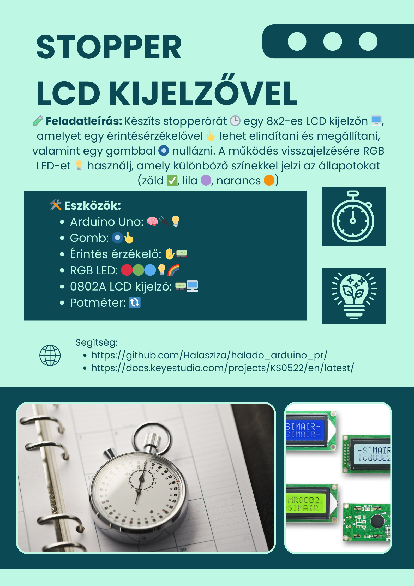
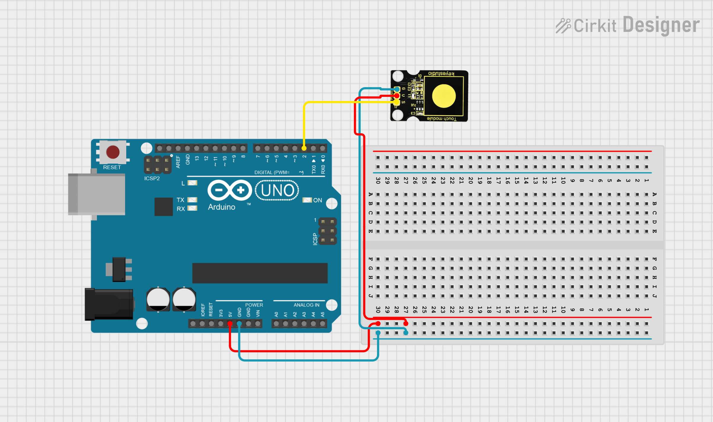
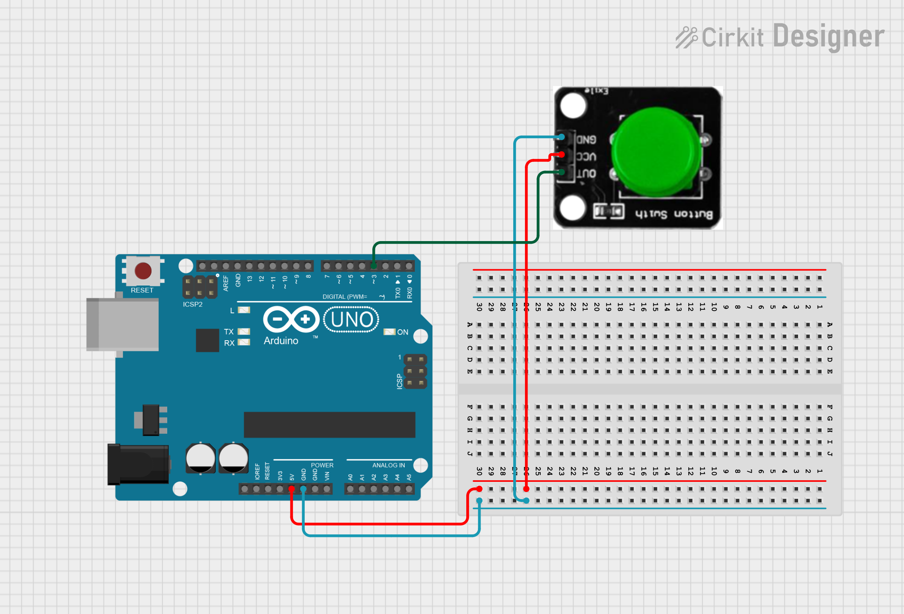
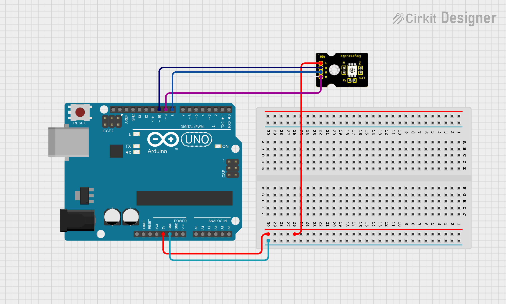
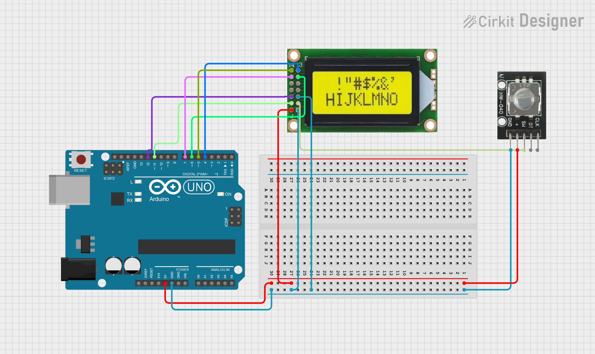

# Stopperóra LCD kijelzővel és RGB Leddel



---

## Érintés érzékelő

📄 Leírás

Unod már a mechanikus gombok nyomkodását? 🤯 Próbáld ki a kapacitív érintésérzékelőnket! 👆
Az érintésérzékelők gyakran megtalálhatók különféle elektronikai eszközökben – most pedig a saját Arduino projektedet is feldobhatod vele! 🚀✨

Ez a kis szenzor érzékeli az emberi test vagy fém érintését, és HIGH/LOW jelszinttel jelez vissza. ⚡
Még akkor is működik, ha vékony ruhával 👕 vagy papírral 📄 van elválasztva – bár a érzékenység csökken, ha a szigetelő réteg túl vastag lesz.

📈 Folyamatosan fejlesztjük ezeket a szenzormodulokat, hogy még jobb élményt nyújtsanak számodra!

⚙️ Műszaki adatok
- 🔋 Tápfeszültség: 3.3V – 5V
- 🔌 Interfész: Digitális (Digital)
- 📏 Méret: 30 x 20 mm
- ⚖️ Tömeg: 3 g

Kapcsolási rajz:



Példakód:
``` cpp
int ledPin = 8;

int KEY = 2;

void setup()
{
  pinMode(ledPin, OUTPUT);
  pinMode(KEY, INPUT);
}
void loop()
{
  if(digitalRead(KEY)==LOW) 
  {
  digitalWrite(ledPin, HIGH);
  }
  else
  {
    digitalWrite(ledPin, LOW);
  }
}
```
> Bármelyik színnel ki lehet próbálni, akár az összessel!

## Gomb 🔘

**📘 Leírás:** Ez egy alap nyomógomb modul 🟠. Egyszerűen bedugható egy IO shield-be, így ideális az első Arduino próbálkozásokhoz 🤖.

**✨ Jellemzők:**
- Széles feszültségtartomány: 3.3V – 5V 🔋
- Könnyen felismerhető érzékelő interfészek – „A” az analóg, „D” a digitális jelekhez 📟
- Szabványos rögzítő furat 🔩
- Áttekinthető ikonokkal jelölve 👀
- Magas minőségű csatlakozó 🔌
- Egyszerűen csatlakoztatható és használható 🧩
- Nagyméretű gomb és strapabíró gombfedél 🔘
- Kiváló interaktív és kreatív projektekhez 🎮🎨

**⚙️ Specifikáció:**
- Tápfeszültség: 3.3V – 5V 🔋
- Interfész: Digitális 📟
- Méretek: 30 × 20 mm 📏
- Tömeg: 4 g ⚖️

**Kapcsolási rajz:**



**Példakód:**
``` cpp
////////////////////////////////////////////////////////////////////
/* # When you push the digital button, the Led on the board will be turned on. Otherwise,the led is turned off.
*/
int redled = 8; // initialize digital pin 8.
int inputPin = 3;               // Connect sensor to input pin 5
void setup() {
  pinMode(redled, OUTPUT);      // set LED as output
  pinMode(inputPin, INPUT);     // set pushbutton as input
}
void loop(){
  int val = digitalRead(inputPin);  // read input value
  if (val == HIGH) {            // check if the input is HIGH
    digitalWrite(redled, HIGH);  // turn LED OFF

  } 
  else {
    digitalWrite(redled, LOW); // turn LED ON

  }
}
////////////////////////////////////////////////////////////////////
```

## RGB Led

Leírás 📘

Ez egy teljes színskálás LED modul 🌈, amely három alapszínt tartalmaz – piros 🔴, zöld 🟢 és kék 🔵. Ezek különálló LED fényekként láthatók.

Programozás után a LED-eket sorrendben be- és kikapcsolhatod 💡, vagy PWM (impulzusszélesség-moduláció) analóg kimenetet is használhatsz arra, hogy a három színt összekeverve különböző színeket hozz létre 🎨.

Specifikáció ⚙️
- Színek: piros 🔴, zöld 🟢, kék 🔵
- Fényerő: magas ✨
- Feszültség: 5V 🔌
- Bemenet: digitális szint 💻
- Méret: 30 × 20 mm 📏
- Tömeg: 3g ⚖️

Kapcsolási rajz:



Példakód:
``` cpp
///////////////////////////////////////////////////////////
int redpin = 8;   // Piros LED a 8-as lábra kötve
int greenpin = 9; // Zöld LED a 9-es lábra kötve
int bluepin = 10;  // Kék LED a 10-es lábra kötve
void setup() {
  pinMode(redpin, OUTPUT);
  pinMode(greenpin, OUTPUT);
  pinMode(bluepin, OUTPUT);
}

void loop() {
  digitalWrite(redpin, HIGH);   // Piros LED bekapcsol
  digitalWrite(greenpin, LOW);  // Zöld LED kikapcsol
  digitalWrite(bluepin, LOW);   // Kék LED kikapcsol
  delay(1000);                  // Vár 1 másodpercet

  digitalWrite(redpin, LOW);    // Piros LED kikapcsol
  digitalWrite(greenpin, HIGH); // Zöld LED bekapcsol
  digitalWrite(bluepin, LOW);   // Kék LED kikapcsol
  delay(1000);                  // Vár 1 másodpercet

  digitalWrite(redpin, LOW);    // Piros LED kikapcsol
  digitalWrite(greenpin, LOW);  // Zöld LED bekapcsol
  digitalWrite(bluepin, HIGH);  // Kék LED bekapcsol
  delay(1000);                  // Vár 1 másodpercet
}
```

## Kijelző

📄 Leírás
Ebben a projektben egy 0802-es LCD kijelzőt fogunk vezérelni, amelyhez a V4.0 fejlesztőpanelt használjuk. ⚙️📟

Az LCD kijelző 8 oszlop és 2 sor megjelenítésére képes (8x2 karakter), és a chip működési feszültsége 4,5–5,5V között van. ⚡🔋

Az 0802-es LCD kétféleképpen köthető be a szövegmegjelenítéshez:
- 4-bites módban 🧩
- 8-bites módban 🔗
(attól függően, hány adatvezetéket használsz)
> Mi a 4-bites módot fogjuk használni a feladat során!

🧰 Szükséges hardverelemek
A következő alkatrészeket kell előkészítened a projekthez: 🔧🧪
- ✅ V4.0 Fejlesztőpanel × 1
- 📟 0802 LCD kijelző × 1
- 🎚️ Forgatható potméter × 1 (a kontraszt beállításához)
- 🧱 Breadboard (próbatábla) × 1
- 🔌 USB kábel × 1 (az áramellátáshoz és programozáshoz)
- 🔗 Ugróvezetékek (jumper wire) – néhány darab
- 🔌 Dupont kábelek – néhány darab (a bekötésekhez)

Kapcsolási rajz:



Példakód:
``` cpp
//////////////////////////////////////////////////////////
#include <LiquidCrystal.h>
// initialize the library with the numbers of the interface pins
LiquidCrystal lcd(11, 12, 6, 7, 4, 5);

void setup() {
  // set up the LCD's number of columns and rows:
  lcd.begin(8, 2);
  // Print a message to the LCD.
  lcd.setCursor(0, 0);
  lcd.print(" Hello");
  lcd.setCursor(0, 1);
  lcd.print(" world!");
}

void loop() {
}
//////////////////////////////////////////////////////////
```
> Fontos: A LiquidCrystal teljes és jól működése érdekében fontos letölteni a hozzá tartozó könyvtárakat is!
> Ezt a bal oldalon a 3. ikonra rákattintva tudod megtenni. Itt a keresőbe beírva 2 könyvtárat is kihoz LiquidCrystal és Adafruit LiquidCrystal néven. Érdemes mindettőt letölteni, ha esetleg nem lenne rajta a gépen!

---
# Teljes rendszer

A projekt célja egy stopperóra rendszer megvalósítása 🕒 Arduino segítségével, amely egy 8x2-es karakteres LCD kijelzőn 🖥️ jeleníti meg az eltelt időt. A stopper elindítása és megállítása egy érintésérzékelővel történik 👆, míg a nullázást egy külön nyomógombbal lehet végrehajtani 🔘.

A rendszer vizuális visszajelzést is ad egy RGB LED segítségével 💡:
- Normál állapotban (amikor a stopper nem fut) a LED zölden világít ✅.
- Az érintésérzékelő aktiválásakor, azaz a stopper elindításakor vagy megállításakor a LED lilára vált 🟣.
- A RESET gomb megnyomásakor a LED narancssárgára vált 🟠, jelezve, hogy a stopper visszaállt 00:00-ra.

Az LCD kijelző első sora a "Stopper" feliratot mutatja, a második sor pedig az aktuális időt perc:másodperc formátumban (pl. 02:37). A rendszer működése közben kis késleltetés (200 ms) biztosítja a kijelző stabil frissítését és a gombnyomások zavartalan kezelését ⏳.

Ez a projekt jól szemlélteti az időmérés, LCD-kezelés, szenzorhasználat és RGB LED vezérlés alapjait, így kiváló kiindulópont kezdők számára az Arduino világában 🔧📗.

Kapcsolási rajz:


Egy kis segítség a stopperórához:
``` cpp
unsigned long startTime = 0;
unsigned long elapsedTime = 0;

void setup() {
  lcd.print("Ido:");

  startTime = millis();  // induláskor elmentjük az indulási időt
}

void loop() {
  // Számoljuk az eltelt időt
  elapsedTime = millis() - startTime;

  // Számítsuk ki a perceket és másodperceket
  unsigned int seconds = (elapsedTime / 1000) % 60;
  unsigned int minutes = (elapsedTime / 60000);

  // Kiírás LCD-re
  lcd.setCursor(0, 1);
  if (minutes < 10) lcd.print("0");
  lcd.print(minutes);
  lcd.print(":");
  if (seconds < 10) lcd.print("0");
  lcd.print(seconds);

  delay(200); // frissítés 5x másodpercenként
}
```
> A kijelző kódját kell kiegészíteni!

# Extra feladat

🟡 1. Maximális idő mentése
🕓 Keresd meg a leghosszabb stopperfutást, és írd ki az LCD-n, ha új rekord születik!

Leírás:
Menteni kell, hogy mennyi volt a stopper eddigi leghosszabb futása. Ha új rekordot ér el a felhasználó, az LCD-n jelenjen meg pl. „🥇Rekord!” felirat a felső sorban egy kis időre.

🔵 2. Villogó kijelzés, ha kerek idő van
🎯 Ha az eltelt idő pontosan 1:00, 2:00 stb., akkor villogjon a kijelzés!

Leírás:
Ellenőrizd, hogy a másodpercek értéke 0, és perc > 0. Ha igen, 1 másodpercig villogtathatod a kijelző tartalmát, vagy megjelenítheted a „Kerek idő!” szöveget az első sorban.
